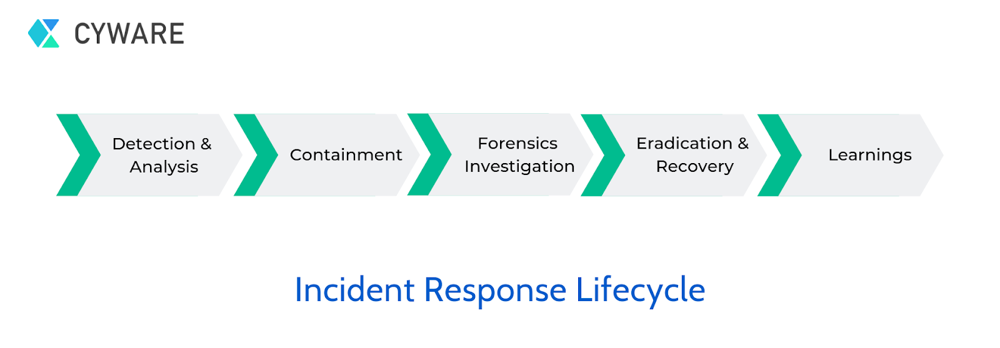
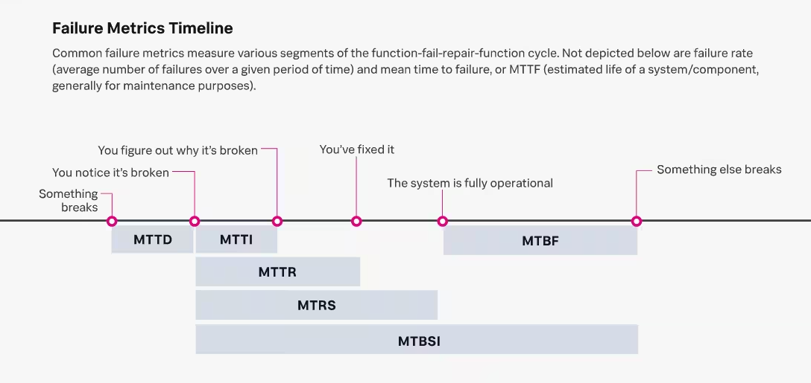
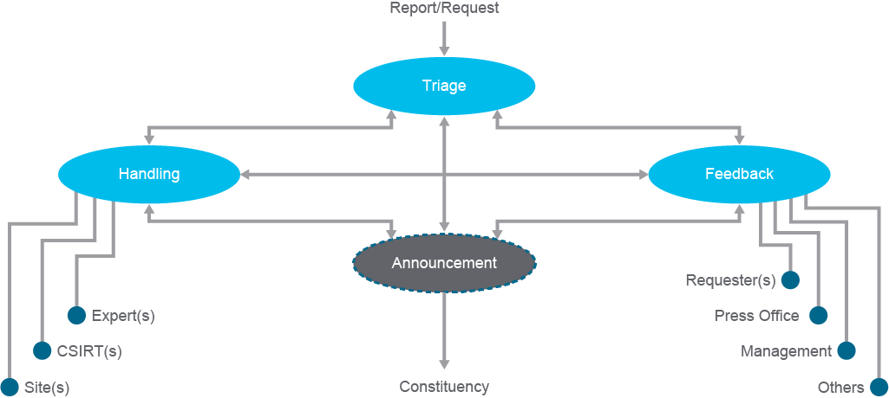
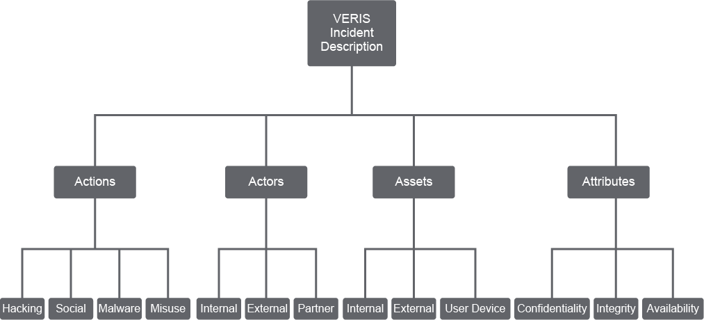

- Incident response encompasses the people, processes, and technology used to detect and respond to security incidents.
- An incident response plan establishes the procedures for managing security incidents that may compromise the confidentiality, integrity, and availability of critical infrastructure and informational system assets.
- Security success is not just about keeping threats out of your network—security is also about quickly responding to and thwarting an attack when it happens.

# Incident Response Planning
- The incident response plan is used to prevent or minimize disruption of critical computing services, minimize the loss of proprietary and confidential information, and facilitate information exchange among the groups responsible for detecting, identifying, reporting, containing, eradicating, and repairing security incidents.
- To develop an effective incident response plan, an organization must know what assets it is trying to protect. Each organization must answer four basic questions when determining their incident response plan:
  - What are the assets that are being protected?
  - What are the threats to the assets?
  - How are threats detected?
  - How will the organization respond to threats?

# Incident Response Life Cycle

- **Preparation**: The goal of the preparation phase is to get the company team and resources ready to handle a security incident.
- **Identification**: The SOC analyst performs continuous monitoring and active cyber threat hunting. The incident response team is activated when a positive incident has been detected.
- **Analysis**: The incident response team should work quickly to analyze and validate each incident, following a predefined process and documenting each step.
- **Containment**: Incident containment is perhaps the most challenging and vital decision made during an incident.
- **Eradication and recovery**: The incident response team investigates to find the origin of the incident. The root cause of the problem and all traces of potentially malicious code are removed, which may also involve changing passwords for accounts, hardening systems, and so on.
- **Lessons Learned**: The incident response team analyzes how and why the incident happened and performs a Failure Mode and Effects Analysis (FMEA) against it.
- **Reporting**: The incident response plan should include provisions concerning incident reporting.

# Incident Response Policy Elements
Most incident response policies include common primary elements. Primary incident response policy elements include:
- The organizational **mission, strategies, and goals** for incident response. 
- **Incident response approach**: Organizations need a functional CSIRT composed of trained and dedicated incident responders committed to the role with few other IT or security responsibilities.
  - Everyone in an organization has a role in incident response, regardless of the department in which they work.
  - Important stakeholders such as legal, human resources, executive management, and public relations should know their roles and responsibilities during a security event.
- Once an organization develops the incident response plan, it must have **management approval** before implementing it.
- Representing the reporting phase of the incident response life cycle, the incident response team will continuously **communicate** with the rest of the organization and other organizations.
- The organization should **review the incident response plan** at least annually to ensure that the organization is maturing its incident response capability.
- **Metrics** measure the incident response capability and its effectiveness.

  - **Mean time to detect (MTTD)** or **Mean time to identify (MTTI)** or **Dwell**: The average time an unauthorized user has access to systems or environments.
  - **Mean time to acknowledge (MTTA)**: The amount of time between a system generating an alert and a member of your IT staff responding to the alert.
  - **Mean time to repair/remediate/recovery/resolution (MTTR)**: The amount of time it takes to get an affected system back up and running again.
  - **Mean time to restore service (MTRS)**: The mean time to restore service is similar to the mean time to repair service, but it only covers the period from when repairs begin to when full functionality is restored rather than the time from failure to resolution.
  - **Mean time to contain (MTTC)**: It focuses on how long your incident response team takes to detect an incident, acknowledge the incident, and effectively prevent a cybercriminal from doing more harm. To calculate MTTC, take the sum of the hours spent detecting, acknowledging, and resolving an alert and divide it by the number of incidents.
  - **Mean time to repair (MTTR)** or **Serviceability**: The average time it takes to repair a system.
  - **Mean time between failures (MTBF)** or **Availability**: The average time between system breakdowns.
  - **Mean time between system incidents (MTBSI)** or **Reliability**: _MTBSI = MTBF + MTRS_

# Incident Attack Categories
- Incident classifications are typically based on incident severity.

# Regulatory Compliance
Many compliance regulations, like PCI DSS, contain incident response requirements to guarantee essential data security.
- The **Payment Card Industry Data Security Standard (PCI DSS)** protects cardholder data wherever it is processed, stored, or transmitted. 
- The **Sarbanes-Oxley Act of 2002 (often shortened to SarbOx or SOX)** is meant to prevent shareholders (and other interested parties) from being misled by corporations about their financial status.
- The **HIPAA** provides data privacy and security provisions for safeguarding medical information and ensures patient confidentiality for all healthcare-related data.
- The **PHI** privacy rule protects all identifiable health information held or transmitted by a covered entity or its business associate in any form or media, whether electronic, paper, or oral.

# Computer Security Incident Response Team (CSIRT)
CSIRT is a service organization responsible for receiving, reviewing, and responding to computer security incident reports and activity.
- The primary mission of a CSIRT is to help ensure company, system, and data preservation by performing comprehensive investigations into computer security incidents and to contribute to preventing such incidents by engaging in threat assessment and detection, mitigation planning, incident trend analysis, and security architecture review.
- A CSIRT can be described in terms of what it sets out to do (mission), for whom (constituency), what its roots look like (place in the organization), and who its peers are (relationship to others)
- No single set of service definitions, policies, and procedures would be appropriate for any two CSIRTs.
## CSIRT Categories
Some general categories of CSIRTs include, but are not limited to, the following:
- **Internal CSIRTs**
- **National CSIRTs**
- **Coordination centers** coordinate and facilitate the handling of incidents across various CSIRTs.
- **Analysis centers** focus on synthesizing data from various sources to determine trends and patterns in incident activity.
- **Vendor teams** handle reports of vulnerabilities in their software or hardware products.
- **Incident response providers** offer incident handling services as a for-fee service to other organizations.
## CSIRT Incident Handling Services
- Well-defined policies and procedures should support all CSIRT services.
- A CSIRT can offer both reactive and proactive services.
  - An example of a reactive service is the incident handling service.
  - An example of a proactive service is the security audits or assessments service.
- The incident handling service consists of the triage, handling, announcement, and feedback functions.

  - The **triage** function provides a single point of contact and the focal point for accepting, collecting, sorting, ordering, and passing on incoming information for the service.
  - The **handling** function provides support and guidance for suspected or confirmed computer security incidents, threats, and attacks.
  - The **feedback** function supports feedback on issues unrelated to specific incidents.
  - The **announcement** (optional) function generates information tailored for the constituency to disclose details of ongoing threats.

# Vocabulary for Event Recording and Incident Sharing (VERIS)
Using standard VERIS metrics, organizations can compare their incidents to other organizations', revealing new sources of helpful information, including comparing customer metrics and worldwide averages, before-and-after metrics when a new security control is implemented, threat trends to verify security is improving, and others.
- The VERIS community database (VCDB) is an open and accessible repository of publicly reported security incidents recorded in the VERIS format.
## VERIS Incidents Structure
- Incidents that are documented using the VERIS schema and structure may contain the following five main sections:
  - The **incident tracking** section captures general information about the incident.
  - The **victim demographics** section describes (but does not identify) the organization affected by the incident.
  - The **incident description** section translates the incident narrative of “who did what to what (or whom) with what result” into a more suitable form for trending and analysis.
  - The **discovery and response** section focuses on the timeline of the events, how the incident was discovered, and lessons learned during the response and remediation process.
  - The **impact assessment** section applies three perspectives of the impact to provide an understanding and measure of the consequence associated with the incident.
 ## VERIS 4 A's
 The VERIS actors, actions, assets, and attributes (4 A's) represent the minimum information required to describe any incident or threat scenario adequately. 

### Actors or Agents
Threat actors are the entities that cause or contribute to an incident.
- **External actors** are external threats originating from sources outside the organization and its network.
- **Internal actors** are the internal threats that originate within the organization.
- **Partner actors** include any third party sharing a business relationship with the organization.
### Actions
Threat actions describe what the threat actor did to cause or contribute to the incident.
- Malware is defined by VERIS as “any malicious software, script, or code that is run on a device that alters its state or function without the owner’s informed consent," which would include viruses, spyware, backdoors, worms, and keyloggers. There are four subcategories or attributes for malware:
  - **Malware variety** describes the malware varieties or functions involved in the incident.
  - **Malware vector** describes the path of attack or infection.
  - **Malware vulnerabilities** captures the specific vulnerability exploited by the malware.
  - **Malware common name** is the common name or strain of the malware.
- Hacking is defined within VERIS as “all attempts to intentionally access or harm information assets without (or exceeding) authorization by circumventing or thwarting logical security mechanisms," which would include brute force, denial of service attacks, SQL injections, and cryptanalysis. This SOC uses two attributes to describe hacking: variety and vector.
- Social action includes using deception, intimidation, and manipulation to exploit the human element. This SOC uses two attributes to describe a social attack: variety and vector.
- Misuse is defined as the use of entrusted organizational resources or privileges for any purpose contrary to what was intended, which includes misuse or abuse of corporate assets, access privileges, and policy violations, among others.
### Assets
Assets are the information assets that were compromised during the incident. “Compromised” refers to any loss of confidentiality/possession, integrity/authenticity, or availability/utility. A typical organization may include the following list of assets:
- Network hardware: Routers, switches, IPS, firewall, etc.
- Server: Mail server, web server, application server, etc.
- User device: Laptop, desktop, smartphone, tablet, etc.
- Others: End user, storage media, etc.
### Attributes
Attributes are the security attributes of the identified assets that were compromised during the incident. VERIS uses a paired version of the six primary security attributes of confidentiality/possession, integrity/authenticity, and availability/utility, an extension of the “C-I-A triad.”

# Playbook

---
## Resources
- [NIST Computer Security Incident Handling Guide](https://nvlpubs.nist.gov/nistpubs/SpecialPublications/NIST.SP.800-61r2.pdf)
- [VERSI](https://verisframework.org/index.html)
