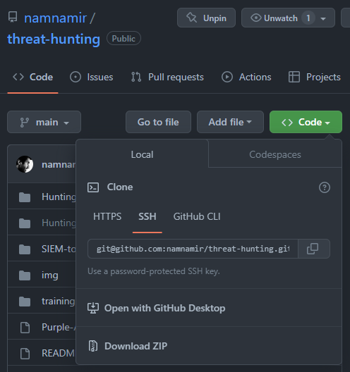
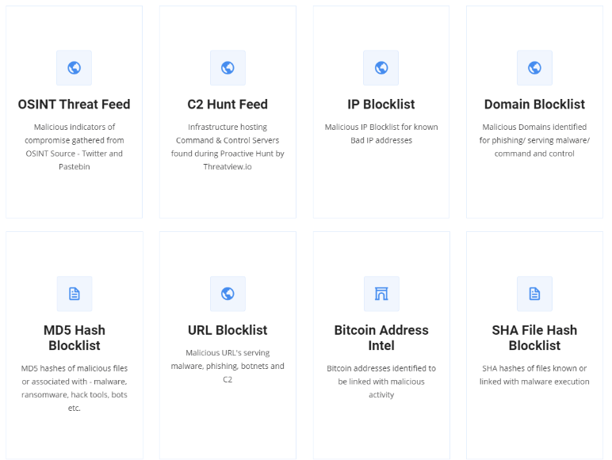
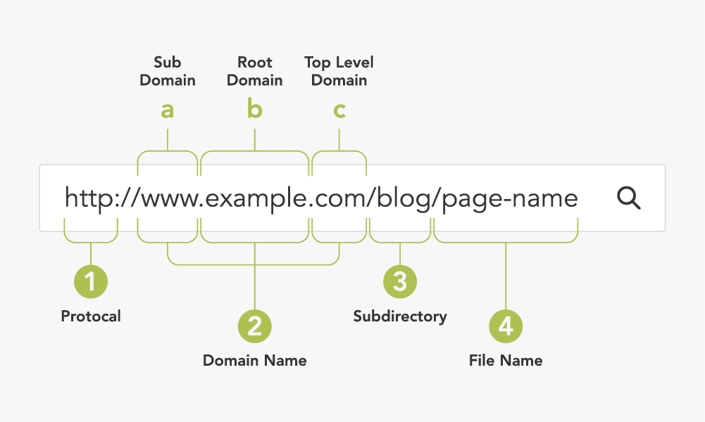
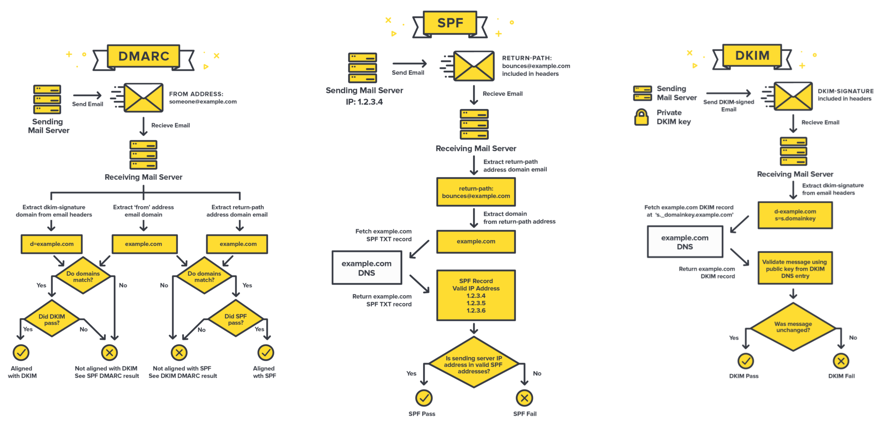

# Sandbox
A Malware sandbox is a cybersecurity term referring to a specially prepared monitoring environment that mimics an end-user operating environment. Sandboxes represent an important tool in the arsenal of computer security experts and are used in conjunction with dynamic malware analysis techniques to safely observe the behavior of suspected malware in a controlled environment without risking a host machine.

Sandbox environments can be employed in a variety of configurations, depending on the needs of security researchers:
- Full system emulation: A sandbox simulating the physical hardware of the host machine, including memory and CPU.
- Emulation of operating systems: A sandbox emulating the operating system of the end user. It does not emulate the machine hardware.
- Virtualization: A virtual machine (VM)-based sandbox that contains and examines suspicious programs.

Sandboxes prevent applications from gaining access to all system resources and user data, and thus provide proactive malware detection. A sandboxing test executes or detonates code in a safe and isolated environment, where the behavior of the code and output activity can be safely observed.

In the past, sandboxes were not only used for investigation purposes but also for threat detections (honeypoting). However, sandboxing never really did deliver on its promise: to turn the unknown threats into the known ones. Therefore, the detection part is more left to new solutions like endpoint detection and response (EDR) and next-generation antivirus (NGAV). As technologies get evolved, adeversaries get smarter; they do not get easily fooled by honeypots.

[](https://www.youtube.com/watch?v=26isu3cm_Oc)


## Difference Between Honeypots and Snadboxes
At a high level, sandboxing involves installing and allowing malware to run for behavioral observation, while honeypots and nets focus on the analysis of threat actors conducting reconnaissance on an infiltrated network, and security deception is the more recent conception of advanced intrusion detection and prevention.

## How to Prepare a Sandbox
There are two general ways to do it; either build our own environment or use 3rd party solutions.

### How to Make Your Own Sandbox
1. Think of dedicated hardware, self-hosted virtual environment (VM), virtual servers (VPS), or cloud services.
2. Install the operationg system (OS) you need for your research.
3. Allocated enough resources (CPU/GPU, RAM, Disk) based on your OS and the purpose of the research.  
4. Setup a different network.  
  4.1. Think of adding your sandbox into DMZ, if your goal is to have internet access.  
  4.2. Isolate the newrok but do not restric it as it should mimic a normal environment.  
5. Install applications an average user (from your research population) uses.
6. Install analysis tools.  
  6.1. Debuggers  
  6.2. Traffic Analyzer  
  6.3. Process Monitoring  
  6.4. Disassemblers  
7. Turn off security tools, e.g., antivirus

[](https://www.youtube.com/watch?v=oPsxy9JF8FM)

Alternatively, you can use solutions like [Cuckoo](https://cuckoosandbox.org/) that is a modular, automated malware analysis system. Running from command-line on a Linux or Mac host, it uses python and virtualization (VirtualBox, QEMU-KVM, etc) to create an isolated Windows guest environment to safely and automatically run and analyze files to collect comprehensive file behavior analysis.

### 3rd-Party Sandbox Solutions
Nowadays, the majority of 3rd-pary sandboxes are ready-made cloud-based or SaaS solutions. In this case, you do not need to prepare anything; you just bring your any research material (IoC, file, hash, etc.) and run it on the cloud-based or SaaS sandbox platform. Followings are the most famous and gratis services.

You need to use them based on the need you have. For instance, URLscan provides something that Any.Run cannot.
- [Any.Run](https://any.run/)
- [VirusTotal](https://www.virustotal.com/)
- [Joe Sandbox](https://www.joesandbox.com/)
- [Hybrid Analysis](https://Hybrid-Analysis.com)
- [URLscan](https://urlscan.io/)
- [Malwares.com](https://www.malwares.com/)
- [Jotti](https://virusscan.jotti.org/)
- [InQuest - IOC-DB](https://labs.inquest.net/iocdb)
- [CheckPhish](https://checkphish.ai/)


# Basic Scripting Techniques
A scripting language or script language is a programming language for a runtime system that automates the execution of tasks that would otherwise be performed individually by a human operator. Scripting languages are usually interpreted at runtime rather than compiled.

Here we focus on Python as a cross-platform scripting language as well as basic Bash (built-in Linux / MacOS shell) and PowerShell (built-in Windows shell).

## Git
Git is a tool to control version of codes. There are many platforms provide Git services including [GitHub](https://github.com/), [GitLab](https://about.gitlab.com/), and [Bitbucket](https://bitbucket.org/). These services, host codes as well that would be a great resource of finding useful scripts.

Here we are not going to the details, as we just like to know how to **clone** a repository to run it locally. In general there are 3 ways: either download the repository (easiest way for beginners), or after installing Git ([how?](https://github.com/git-guides/install-git)), or clone it with either SSH or HTTPS.



```bash
# clone using SSH via terminal
git clone SSH_OR_HTTPS_LINK
```

[](https://www.youtube.com/watch?v=CKcqniGu3tA)

## Python
After you [install Python](https://wiki.python.org/moin/BeginnersGuide/Download), you barely need to _script_ but you mainly need to run scripts developed by others. To run scripts, use the following commands.
```bash
# if you run Python version 3
python3 SCRIPT_NAME.py

# if you run Python version 2 or Python version 3 is set to default
python3 SCRIPT_NAME.py
```

If you like to learn basic programming skills in Python, just google it to find many free videos and tutorials like [LearnPython](https://www.learnpython.org/) or the following video.

[](https://www.youtube.com/watch?v=kqtD5dpn9C8)


# Evasion Techniques
Evasion techniques are what malicious payloads use to avoid detection from EDR, IDS/IPS, Sandboxing services, etc. Malware developers have two priorities when creating malware, being silent and being deadly, getting as much as they can for as little effort as possible. To do so, they use different techniques and tactics; it can be something low-level, high-level, or mixture of different techniques and tactics. In this section, we just focus on **malware evasion techniques**.

Defense evasion is the way to bypass detection, cover what malware is doing, and determine its activity to a specific family or authors. There are different techniques used by threat actors like injection, data encryption, and obfuscating. The tactics often induce payloads and scripts. Some of these techniques are as follows.

- Code Obfuscation and Encryption: Detection solutions can find malware's activities easily. Malware tries to hide malicious codes by obfuscation and encryption.
- Hide Artifacts: Artifacts reveal malicious activity such as files, directories, file attributes, users, etc. Malware tries to hide or isolate them to bypass detection.
- Modify Registry: Change of registry allows the malicious software to conceal data about configuration.
- Virtualization/Sandbox Evasion: Sandboxes are a real challenge for a malicious program. But it knows how to avoid a standard sandbox and recognize the virtual environment from a real one.
- Embeded Codes: Docx or PDF files seem safe but what if an attacker embeds the payload in another file and run it through them?

This video shows how a read team prepare a malware with using multiple evasion techniques and tactics.

[](https://www.youtube.com/watch?v=5goLhInZyYQ)

# Threat Intelligence Feeds
Threat intelligence feeds are continuous data streams filled with threat information collected by artificial intelligence. These feeds provide information on cybersecurity threats and trends in real-time, enabling organizations to proactively defend against attacks. Security teams can also use this information to better understand potential hackers' tactics, techniques, and procedures and improve their security posture accordingly.

## Common Type of Artifacts (Feeds)
- **AS**: Autonomous system
- **aba-rtn**: ABA routing transit number
- **anonymised**: Anonymised value - described with the anonymisation object via a relationship
- **attachment**: Attachment with external information
- **authentihash**: Authenticode executable signature hash
- **bank-account-nr**: Bank account number without any routing number
- **bic**: Bank Identifier Code Number also known as SWIFT-BIC, SWIFT code or ISO 9362 code
- **bin**: Bank Identification Number
- **boolean**: Boolean value - to be used in objects
- **bro**: An NIDS rule in the Bro rule-format
- **btc**: Bitcoin Address
- **campaign-id**: Associated campaign ID
- **campaign-name**: Associated campaign name
- **cc-number**: Credit-Card Number
- **cdhash**: An Apple Code Directory Hash, identifying a code-signed Mach-O executable file
- **chrome-extension-id**: Chrome extension id
- **comment**: Comment or description in a human language
- **community-id**: a community ID flow hashing algorithm to map multiple traffic monitors into common flow id
- **cookie**: HTTP cookie as often stored on the user web client. This can include authentication cookie or session cookie.
- **cortex**: Cortex analysis result
- **counter**: An integer counter, generally to be used in objects
- **country-of-residence**: The country of residence of a natural person
- **cpe**: Common Platform Enumeration - structured naming scheme for information technology systems, software, and packages.
- **dash**: Dash Address
- **date-of-birth**: Date of birth of a natural person (in YYYY-MM-DD format)
- **datetime**: Datetime in the ISO 8601 format
- **dkim**: DKIM public key
- **dkim-signature**: DKIM signature
- **dns-soa-email**: RFC1035 mandates that DNS zones should have a SOA (Statement Of Authority) record that contains an email address where a PoC for the domain could be contacted. This can sometimes be used for attribution/linkage between different domains even if protected by whois privacy
- **domain**: A domain name used in the malware
- **domain|ip**: A domain name and its IP address (as found in DNS lookup) separated by a |
- **email**: An e-mail address
- **email-attachment**: File name of the email attachment.
- **email-body**: Email body
- **email-dst**: The destination email address. Used to describe the recipient when describing an e-mail.
- **email-dst-display-name**: Email destination display name
- **email-header**: Email header
- **email-message-id**: The email message ID
- **email-mime-boundary**: The email mime boundary separating parts in a multipart email
- **email-reply-to**: Email reply to header
- **email-src**: The source email address. Used to describe the sender when describing an e-mail.
- **email-src-display-name**: Email source display name
- **email-subject**: The subject of the email
- **email-thread-index**: The email thread index header
- **email-x-mailer**: Email x-mailer header
- **eppn**: eduPersonPrincipalName - eppn - the NetId of the person for the purposes of inter-institutional authentication. Should be stored in the form of user@univ.edu, where univ.edu is the name of the local security domain.
- **favicon-mmh3**: favicon-mmh3 is the murmur3 hash of a favicon as used in Shodan.
- **filename**: Filename
- **filename-pattern**: A pattern in the name of a file
- **filename|authentihash**: A checksum in md5 format
- **filename|impfuzzy**: Import fuzzy hash - a fuzzy hash created based on the imports in the sample.
- **filename|imphash**: Import hash - a hash created based on the imports in the sample.
- **filename|md5**: A filename and an md5 hash separated by a |
- **filename|pehash**: A filename and a PEhash separated by a |
- **filename|sha1**: A filename and an sha1 hash separated by a |
- **filename|sha224**: A filename and a sha-224 hash separated by a |
- **filename|sha256**: A filename and an sha256 hash separated by a |
- **filename|sha3-224**: A filename and an sha3-224 hash separated by a |
- **filename|sha3-256**: A filename and an sha3-256 hash separated by a |
- **filename|sha3-384**: A filename and an sha3-384 hash separated by a |
- **filename|sha3-512**: A filename and an sha3-512 hash separated by a |
- **filename|sha384**: A filename and a sha-384 hash separated by a |
- **filename|sha512**: A filename and a sha-512 hash separated by a |
- **filename|sha512/224**: A filename and a sha-512/224 hash separated by a |
- **filename|sha512/256**: A filename and a sha-512/256 hash separated by a |
- **filename|ssdeep**: A checksum in ssdeep format
- **filename|tlsh**: A filename and a Trend Micro Locality Sensitive Hash separated by a |
- **filename|vhash**: A filename and a VirusTotal hash separated by a |
- **first-name**: First name of a natural person
- **float**: A floating point value.
- **frequent-flyer-number**: The frequent flyer number of a passenger
- **full-name**: Full name of a natural person
- **gender**: The gender of a natural person (Male, Female, Other, Prefer not to say)
- **gene**: GENE - Go Evtx sigNature Engine
- **git-commit-id**: A git commit ID.
- **github-organisation**: A github organisation
- **github-repository**: A github repository
- **github-username**: A github user name
- **hassh-md5**: hassh is a network fingerprinting standard which can be used to identify specific Client SSH implementations. The fingerprints can be easily stored, searched and shared in the form of an MD5 fingerprint.
- **hasshserver-md5**: hasshServer is a network fingerprinting standard which can be used to identify specific Server SSH implementations. The fingerprints can be easily stored, searched and shared in the form of an MD5 fingerprint.
- **hex**: A value in hexadecimal format
- **hostname**: A full host/dnsname of an attacker
- **hostname|port**: Hostname and port number separated by a |
- **http-method**: HTTP method used by the malware (e.g. POST, GET, …).
- **iban**: International Bank Account Number
- **identity-card-number**: Identity card number
- **impfuzzy**: A fuzzy hash of import table of Portable Executable format
- **imphash**: Import hash - a hash created based on the imports in the sample.
- **ip-dst**: A destination IP address of the attacker or C&C server
- **ip-dst|port**: IP destination and port number separated by a |
- **ip-src**: A source IP address of the attacker
- **ip-src|port**: IP source and port number separated by a |
- **issue-date-of-the-visa**: The date on which the visa was issued
- **ja3-fingerprint-md5**: JA3 is a method for creating SSL/TLS client fingerprints that should be easy to produce on any platform and can be easily shared for threat intelligence.
- **jabber-id**: Jabber ID
- **jarm-fingerprint**: JARM is a method for creating SSL/TLS server fingerprints.
- **kusto-query**: Kusto query - Kusto from Microsoft Azure is a service for storing and running interactive analytics over Big Data.
- **last-name**: Last name of a natural person
- **link**: Link to an external information
- **mac-address**: Mac address
- **mac-eui-64**: Mac EUI-64 address
- **malware-sample**: Attachment containing encrypted malware sample
- **malware-type:
- **md5**: A checksum in md5 format
- **middle-name**: Middle name of a natural person
- **mime-type**: A media type (also MIME type and content type) is a two-part identifier for file formats and format contents transmitted on the Internet
- **mobile-application-id**: The application id of a mobile application
- **mutex**: Mutex, use the format \BaseNamedObjects<Mutex>
- **named pipe**: Named pipe, use the format .\pipe<PipeName>
- **nationality**: The nationality of a natural person
- **other**: Other attribute
- **passenger-name-record-locator-number**: The Passenger Name Record Locator is a key under which the reservation for a trip is stored in the system. The PNR contains, among other data, the name, flight segments and address of the passenger. It is defined by a combination of five or six letters and numbers.
- **passport-country**: The country in which the passport was issued
- **passport-expiration**: The expiration date of a passport
- **passport-number**: The passport number of a natural person
- **pattern-in-file**: Pattern in file that identifies the malware
- **pattern-in-memory**: Pattern in memory dump that identifies the malware
- **pattern-in-traffic**: Pattern in network traffic that identifies the malware
- **payment-details**: Payment details
- **pdb**: Microsoft Program database (PDB) path information
- **pehash**: PEhash - a hash calculated based of certain pieces of a PE executable file
- **pgp-private-key**: A PGP private key
- **pgp-public-key**: A PGP public key
- **phone-number**: Telephone Number
- **place-of-birth**: Place of birth of a natural person
- **place-port-of-clearance**: The port of clearance
- **place-port-of-onward-foreign-destination**: A Port where the passenger is transiting to
- **place-port-of-original-embarkation**: The original port of embarkation
- **port**: Port number
- **primary-residence**: The primary residence of a natural person
- **process-state**: State of a process
- **prtn**: Premium-Rate Telephone Number
- **redress-number**: The Redress Control Number is the record identifier for people who apply for redress through the DHS Travel Redress Inquiry Program (DHS TRIP). DHS TRIP is for travelers who have been repeatedly identified for additional screening and who want to file an inquiry to have erroneous information corrected in DHS systems
- **regkey**: Registry key or value
- **regkey|value**: Registry value + data separated by |
- **sha1**: A checksum in sha1 format
- **sha224**: A checksum in sha-224 format
- **sha256**: A checksum in sha256 format
- **sha3-224**: A checksum in sha3-224 format
- **sha3-256**: A checksum in sha3-256 format
- **sha3-384**: A checksum in sha3-384 format
- **sha3-512**: A checksum in sha3-512 format
- **sha384**: A checksum in sha-384 format
- **sha512**: A checksum in sha-512 format
- **sha512/224**: A checksum in the sha-512/224 format
- **sha512/256**: A checksum in the sha-512/256 format
- **sigma**: Sigma - Generic Signature Format for SIEM Systems
- **size-in-bytes**: Size expressed in bytes
- **snort**: An IDS rule in Snort rule-format
- **special-service-request**: A Special Service Request is a function to an airline to provide a particular facility for A Passenger or passengers.
- **ssdeep**: A checksum in ssdeep format
- **ssh-fingerprint**: A fingerprint of SSH key material
- **stix2-pattern**: STIX 2 pattern
- **target-email**: Attack Targets Email(s)
- **target-external**: External Target Organizations Affected by this Attack
- **target-location**: Attack Targets Physical Location(s)
- **target-machine**: Attack Targets Machine Name(s)
- **target-org**: Attack Targets Department or Organization(s)
- **target-user**: Attack Targets Username(s)
- **telfhash**: telfhash is symbol hash for ELF files, just like imphash is imports hash for PE files.
- **text**: Name, ID or a reference
- **threat-actor**: A string identifying the threat actor
- **tlsh**: A checksum in the Trend Micro Locality Sensitive Hash format
- **travel-details**: Travel details
- **twitter-id**: Twitter ID
- **uri**: Uniform Resource Identifier
- **url**: url
- **user-agent**: The user-agent used by the malware in the HTTP request.
- **vhash**: A VirusTotal checksum
- **visa-number**: Visa number
- **vulnerability**: A reference to the vulnerability used in the exploit
- **weakness**: A reference to the weakness used in the exploit
- **whois-creation-date**: The date of domain’s creation, obtained from the WHOIS information.
- **whois-registrant-email**: The e-mail of a domain’s registrant, obtained from the WHOIS information.
- **whois-registrant-name**: The name of a domain’s registrant, obtained from the WHOIS information.
- **whois-registrant-org**: The org of a domain’s registrant, obtained from the WHOIS information.
- **whois-registrant-phone**: The phone number of a domain’s registrant, obtained from the WHOIS information.
- **whois-registrar**: The registrar of the domain, obtained from the WHOIS information.
- **windows-scheduled-task**: A scheduled task in windows
- **windows-service-displayname**: A windows service’s displayname, not to be confused with the windows-service-name. This is the name that applications will generally display as the service’s name in applications.
- **windows-service-name**: A windows service name. This is the name used internally by windows. Not to be confused with the windows-service-displayname.
- **x509-fingerprint-md5**: X509 fingerprint in MD5 format
- **x509-fingerprint-sha1**: X509 fingerprint in SHA-1 format
- **x509-fingerprint-sha256**: X509 fingerprint in SHA-256 format
- **xmr**: Monero Address
- **yara**: Yara signature
- **zeek**: An NIDS rule in the Zeek rule-format

[]

## Types of Threat Intelligence
Cyber threat intelligence comes in the following three basic categories:

- Strategic: This type of threat intelligence offers high-level analysis for less technical audiences. It may include information about business impacts and how the threat fits into broader trends in the threat landscape. Most strategic threat intelligence comes from open sources, such as local and national media, or white papers and reports.
- Tactical: This type focuses on IoCs to enable immediate threat identification and elimination. Often considered the most basic form of threat intelligence, tactical threat intelligence is more easily generated and often automated.
- Operational: Operational threat intelligence comes from examining the details of past known attacks. By understanding the details of “who?”, “what?”, and “how?”, security teams gain insight into the motives and sophistication of threat actors.

## Indicators of Compromise (IOC) and Indicator of Attack (IOA)
An Indicator of Compromise (IOC) is often described in the forensics world as evidence on a computer that indicates that the security of the network has been breached. Investigators usually gather this data after being informed of a suspicious incident, on a scheduled basis, or after the discovery of unusual call-outs from the network. Ideally, this information is gathered to create “smarter” tools that can detect and quarantine suspicious files in the future.

Indicators of attack (IOA) focus on detecting the intent of what an attacker is trying to accomplish, regardless of the malware or exploit used in an attack. Just like AV signatures, an IOC-based detection approach cannot detect the increasing threats from malware-free intrusions and zero-day exploits. As a result, next-generation security solutions are moving to an IOA-based approach pioneered by CrowdStrike.

## Why Geopolitical Intels are Important
Cyberwarfare has become a common method of attack in geopolitical conflicts, primarily targeting government entities and critical infrastructure, such as power, utilities, banks, and communication networks. It is also important to recognize that organizations, regardless of size, must take an enhanced security stance especially considering geopolitical tensions, as cyber-attacks represent a growing and probable threat under these circumstances.

For instance, following the February 24, 2022, military invasion of Ukraine by Russia, governments and businesses around the globe are advised to be on high alert and prepared to respond to disruptive cyber activity. Experts now point out that the military invasion was preceeded by several notable cyber incidents, including deployment of wiper malware, distributed denial-of-service (DDoS) attacks on Ukrainian government websites and financial entities, and recurring defacement of multiple Ukrainian government websites. These incidents are thought to be organized and preplanned efforts that were executed with precision2. Cyberattacks have been a key tool of Russian aggression in Ukraine since before 2014, when the Kremlin annexed Crimea and hackers tried to thwart elections.

## The Most Popular Open Source Intel (OSINT)
| Source (Feed) | Description |
|:--------------|:------------|
| [Open Threat Exchange](https://otx.alienvault.com/) | List of malicious IPs, hashes, domains, URLs, and files. |
| [IBM X-Force](https://exchange.xforce.ibmcloud.com/) | List of malicious IPs, hashes, domains, URLs, files, and software names. |
| [Talos](https://www.talosintelligence.com/) | Check the reputation of IPs and domains. |
| [VirusShare](https://virusshare.com/) | List of file hashes |
| [PhishTank](https://www.phishtank.com/index.php) | List of Phishing URLs. |
| [AbuseIPDB](https://www.abuseipdb.com/) | List of IPs of hackers, spammers, and abusive activity on the internet. |
| [VirusTotal](https://www.virustotal.com/) | List of malicious IPs, hashes, domains, URLs, and files. |
| [Joe Sandbox](https://www.joesandbox.com/) | List of malicious files and URLs. |
| [URLscan](https://urlscan.io/) | List of malicious URLs. |
| [Malwares.com](https://www.malwares.com/) | List of malicious IPs, hashes, domains, and URLs. |
| [InQuest - IOC-DB](https://labs.inquest.net/iocdb) | List of malicious IPs, hashes, domains, URLs, and files. |
| [ExoneraTor](https://metrics.torproject.org/exonerator.html) | List of TOR relays. |

# Threat Investigation
While users improve their ability to detect suspicious websites, emails, and files as well as companies spend in security solutions to detect threats before reaching users, adversaries keep designing malicious files and email to deceive users.

There are ways that we can fairly assure the user reported a suspicious artifact that it is malicious or not. Probably you got the point; the user is well-trained to spot suspicious activity, report it, and get help. Our work starts from here not before it. Threat investigators investigate not hunt.

## (Shortened) Link Analysis
If we use the sandbox, it is safe to click on the link and analyze the behavior. However, sometimes, we would like to use OSINT to see what others found about it and how much malicious it is.

Before going to details, we need to understand some basics. A domain is an alphanumeric name that is pointed to an IP address. IP address is the address of the server. However, the real address might be hidden by some security services like *CloudFlare*. Additionally, an domain might have different IP addresses. Besides, URLs (links) consist of multiple elements (including domains) that each part might point to a different IP which in general means point to different servers.
[]

By this short explanation, we need to understand what we are going to analyze: a domain name, and IP, or a URL; let's call it a suspicious artifact.

At this point, we need to talk about another concept which is redirection. Twitter changed URLs a bit as it had character limitation. It was necessary to shorten everything before posting your Tweet. Shorten URLs are kind of redirection. Look at the following structure.
```bash
https://url-you-CLICK.tld
  \_(Redirect 302) https://redirection-01.tld/page
      \_(Redirect 301) https://redirection-02.tld/page
                       .
                       .
                       .
                      \_http://url-you-SEE.tld/page
```
In this example, the user might click on `https://url-you-CLICK.tld` but ended up somewhere completely else. So, it is important to differentiate between the artifact you are going to analyze.

Anyhow, whatever artifact (URL, domain, or IP) you have, it can be checked by any OSINT tool supports the artifact you look for.

## File Analysis
Similarly, you can check files either with sandboxes or analyze them by online tools like VirusTotal. These tools usually check the hash of the file against the list they hold and maintain. Some other tools InQuest or Any.Run run the file and analyze any malicious activity. It is just a matter or time and techniques you have, e.g. reverse engineering, malware analysis.

## Email Analysis
Email is a rich-text file sent through internet from an email server to another. It can contain other files (attachments) too. Therefore, we can see an email as a webpage (HTML) that can have links, JavaScript codes, etc.

For the attachments we can easily go for the **File Analysis** strategy. Similarly, for links, the investigation strategy is provided. However, there might be malicious codes hidden in the email. There might be another threat: impersonation. For these two malicious activities, we need to do deeper investigation.

To find out more about any implemented malicious code in the email, first we need to have the email file. Downloading the email file is fairly easy but depends on the email client you use. When you have the file, the rest is analyzing the codes in the email and find out if it is malicious or not.

Checking for impersonation is not as straightforward as finding malicious codes. For that you need to analyze the header. Hopefully, there are multiple tools helping with parsing email headers (E-Mail Header Analyzer), here are some of them.

| Tool | Description |
|------|-------------|
| [MXToolbox](https://mxtoolbox.com/EmailHeaders.aspx) | Analyze the email header as well as DMARC and SPF |
| [MHA](https://mha.azurewebsites.net/) | Analyze the email header |
| [Messageheader](https://toolbox.googleapps.com/apps/messageheader/) |  |
| [Analyze my mail header](https://mailheader.org/) | Analyze the email header and the encryption |

When you know who is the original sender of the email, you can find out if there was any impersonation or not. The following image, shows how [SPF (Sender Policy Framework)](https://postmarkapp.com/guides/spf), [DKIM (DomainKeys Identified Mail)](https://postmarkapp.com/guides/dkim), and [DMARC (Domain-based Message Authentication, Reporting & Conformance)](https://postmarkapp.com/guides/dmarc) are important in email security and finding the impersonation.

[]

# Documenting and Presenting Findings
One of the requirements is to document security incidents and the forensics investigations about that incident. Here are the things you need to include in your report:
- Who has reported the incident (including date)
- Affected users and assets
- What is is reported
- How the investigation performed (in details)  
- What are the (potential) impacts
- What are the recommendations to mitigate the incident

-----------
References:
- [MISP Data Models](https://www.misp-project.org/datamodels/)
- [Malware Sandbox]([https://www.spiceworks.com/it-security/cyber-risk-management/articles/what-is-sandboxing/](https://www.vmray.com/glossary/malware-sandbox/))
- [The Difference Between Sandboxing, Honeypots & Security Deception](https://www.darkreading.com/endpoint/the-difference-between-sandboxing-honeypots-security-deception)
- [Is Sandboxing Dead?](https://www.darkreading.com/vulnerabilities-threats/is-sandboxing-dead-)
- [What is an Evasion Technique?](https://www.libraesva.com/what-is-an-evasion-technique/)
- [Malware Evasion Techniques](https://www.cyberdefensemagazine.com/malware-evasion-techniques/)
- [What are Threat Intelligence Feeds?](https://securityscorecard.com/blog/what-are-threat-intelligence-feeds)
- [Preparing your organization for elevated cyber threats posed by geopolitical conflicts](https://www2.deloitte.com/content/dam/Deloitte/us/Documents/risk/us-risk-preparing-your-organization-for-elevated-cyber-threats-posed-by-geopolitical-conflicts.pdf)
- [IOA VS IOC](https://www.crowdstrike.com/cybersecurity-101/indicators-of-compromise/ioa-vs-ioc/)
