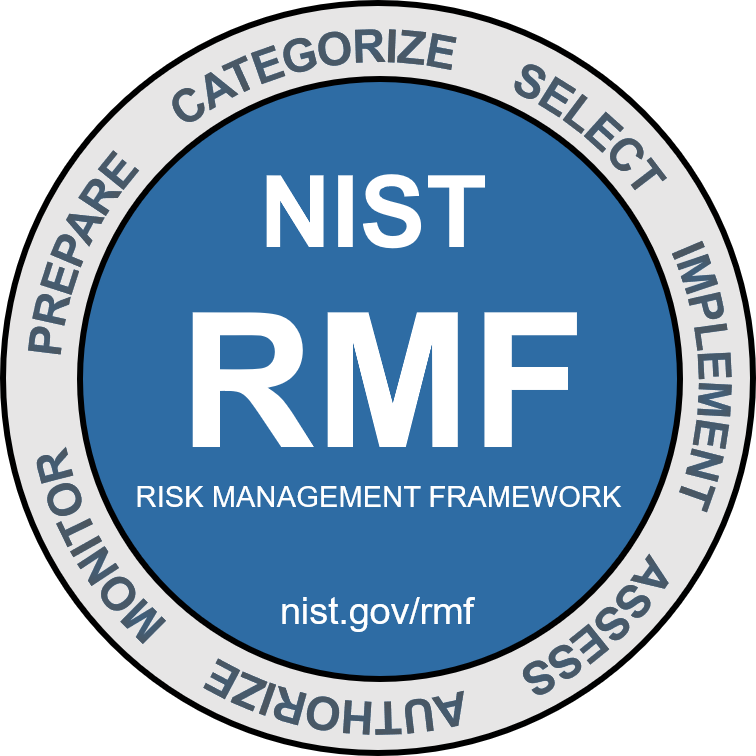

# NIST Risk Management Framework (RMF)
The Risk Management Framework (RMF) provides a process that integrates security, privacy, and cyber supply chain risk management activities into the system development life cycle. The risk-based approach to control selection and specification considers effectiveness, efficiency, and constraints due to applicable laws, directives, Executive Orders, policies, standards, or regulations.

## NIST RMF Steps
 - **Prepare**: Carry out essential activities to help prepare all levels of the organization to manage its security and privacy risks. It has these outcomes:
   - Key risk management roles identified
   - Organizational risk management strategy established, risk tolerance determined
   - Organization-wide risk assessment
   - Organization-wide strategy for continuous monitoring developed and implemented
   - Common controls identified
 - **Categorize**: Inform organizational risk management processes and tasks by determining the adverse impact  with respect to the loss of confidentiality, integrity, and availability of systems and the information processed, stored, and transmitted by those systems. It has these outcomes:
   - System characteristics documented
   - Security categorization of the system and information completed
   - Categorization decision reviewed/approved by authorizing official
 - **Select**: Select, tailor, and document the set of (NIST SP 800-53) controls to protect the system and organization commensurate with risk. It has these outcomes:
   - Control baselines selected and tailored
   - Controls designated as system-specific, hybrid, or common
   - Controls allocated to specific system components
   - System-level continuous monitoring strategy developed
   - Security and privacy plans that reflect the control selection, designation, and allocation are reviewed and approved
 - **Implement**: Implement the controls and document how controls are deployed. It has these outcomes:
   - Controls specified in security and privacy plans implemented
   - Security and privacy plans updated to reflect controls as implemented
 - **Assess**: Determine if the controls are implemented correctly, operating as intended, and producing the desired outcome with respect to meeting the security and privacy requirements for the system and the organization. It has these outcomes:
   - Assessor/assessment team selected
   - Security and privacy assessment plans developed
   - Assessment plans are reviewed and approved
   - Control assessments conducted in accordance with assessment plans
   - Security and privacy assessment reports developed
   - Remediation actions to address deficiencies in controls are taken
   - Security and privacy plans are updated to reflect control implementation changes based on assessments and remediation actions
   - Plan of action and milestones developed
 - **Authorize**: Provide  accountability by requiring a senior official to determine if the security and privacy risk based on the operation of a system or the use of common controls, is acceptable. It has these outcomes:
   - Authorization package (executive summary, system security and privacy plan, assessment report(s), plan of action and milestones)
   - Risk determination rendered
   - Risk responses provided
   - Authorization for the system or common controls is approved or denied
 - **Monitor**: Maintain ongoing situational awareness about the security and privacy posture of the system and organization to support risk management decisions. It has these outcomes:
   - System and environment of operation monitored in accordance with continuous monitoring strategy
   - Ongoing assessments of control effectiveness conducted in accordance with continuous monitoring strategy
   - Output of continuous monitoring activities analyzed and responded to
   - Process in place to report security and privacy posture to management
   - Ongoing authorizations conducted using results of continuous monitoring activities

# The NIST Cybersecurity Framework (NCF)
 - The five core functions that make up the CSF are: *identify*, *protect*, *detect*, *respond*, and *recover*.
   - **identify**: The management of cybersecurity risk and its effect on an organization's people and assets.
   - **protect**: The strategy used to protect an organization through the implementation of policies, procedures, training, and tools that help mitigate cybersecurity threats.
   - **Detect**: Identifying potential security incidents and improving monitoring capabilities to increase the speed and efficiency of detections.
   - **Respond**: Making sure that the proper procedures are used to contain, neutralize, and analyze security incidents, and implement improvements to the security process.
   - **Recover**: The process of returning affected systems back to normal operation.