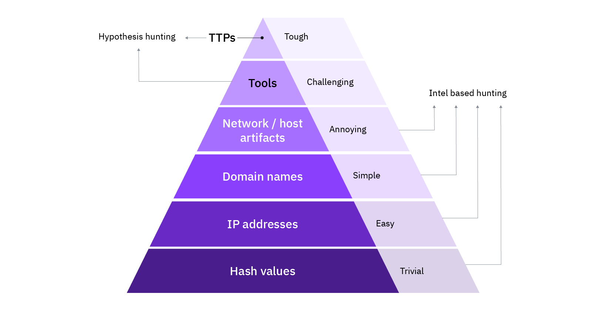
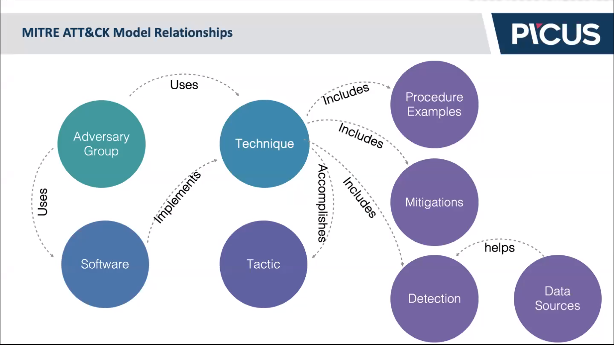

# 0 - The Absolute Beginners Guide to MITRE ATT&CK
## Fundamentals of the MITRE ATT&CK® Framework
- An "Indicator of Compromise (IoC)" is the evidence that a cyberattack has taken place.
- Pyramid of Pain by David Bianco shows how difficult it is to collect and apply the IOC to a cyber defense tool. For instance, Hash Values are easier to use than Tools. But they are not very effective.
  - At the apex of the pyramid, we have TTPs (Tactics Techniques and Procedures).

- Defender's Dilemma:The adversary only needs to breach one of the victims in order to compromise the enterprise. So, only one of the victims is breached, the attacker can move laterally inside the enterprise.
- The Adversary's Dilemma: The defender only needs to detect one of the indicators of the adversary's presence to initiate incident response within the enterprise. So defenders only need to detect one indicator.
  - Also, we can detect one step in a TTP in the TTP chain; we can detect all other steps. And sometimes attackers use defense bypass techniques so we wouldn't be able to detect every step.
- Tactics, Techniques, Procedures (TTP)
    - **Tactics** are the adversary's technical goals.These are our 14 row headings.
    - **Techniques** are how those goals are achieved - methods used to accomplish a tactic. So, for initial access, you can either send a spear-phishing attachment or exploit a public-facing application like an Apache server.
    - **Procedures** are specific implementations of techniques.
    - At the moment, ATT&CK for Enterprise contains 14 tactics, 177 techniques, and 348 sub-techniques.
- For your defenses to be more robust, we should not aim to block malware hashes or IP addresses. Instead, we should try to block the set of techniques used by the malware.
- Each high-level component of ATT&CK is related to the other components in some way. "Adversary Group" is our starting point. They use "Techniques"to accomplish "Tactics". Adversaries also use (malicious) "Software" that implements these techniques. Each technique includes "Procedure" examples by APT groups and malware and includes "Mitigation" suggestions and "Detection" suggestions. "Data sources" and metadata help detection.

