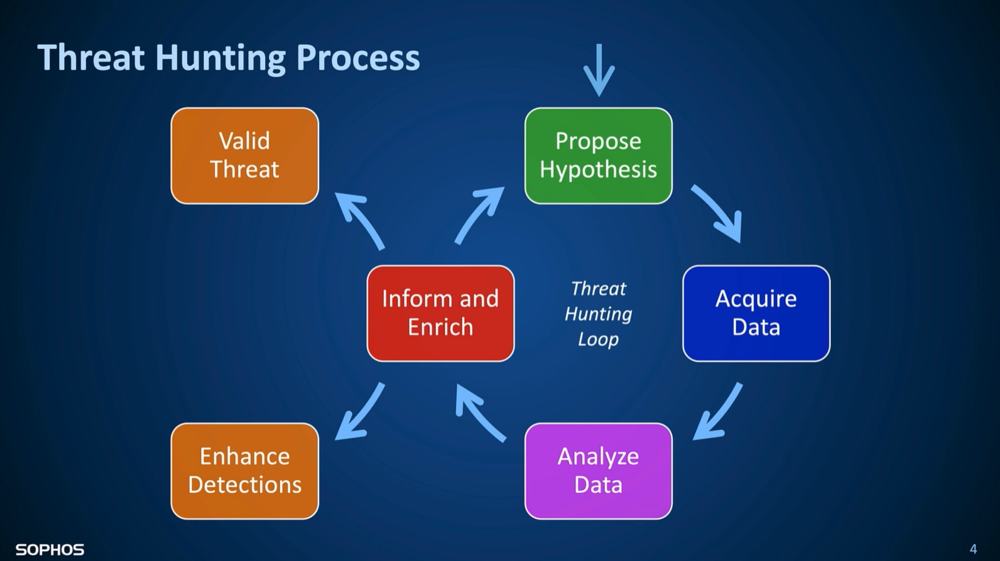
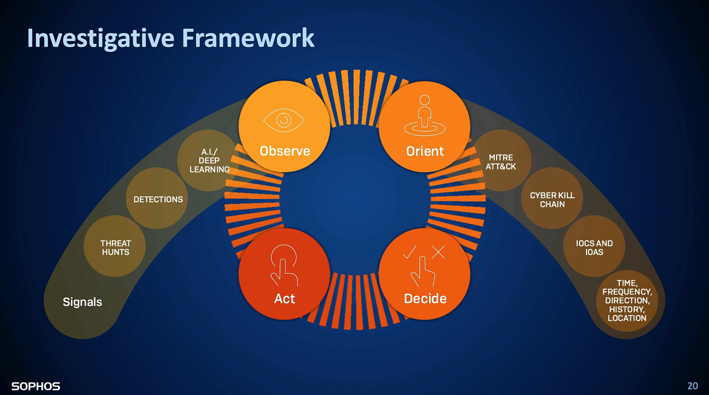
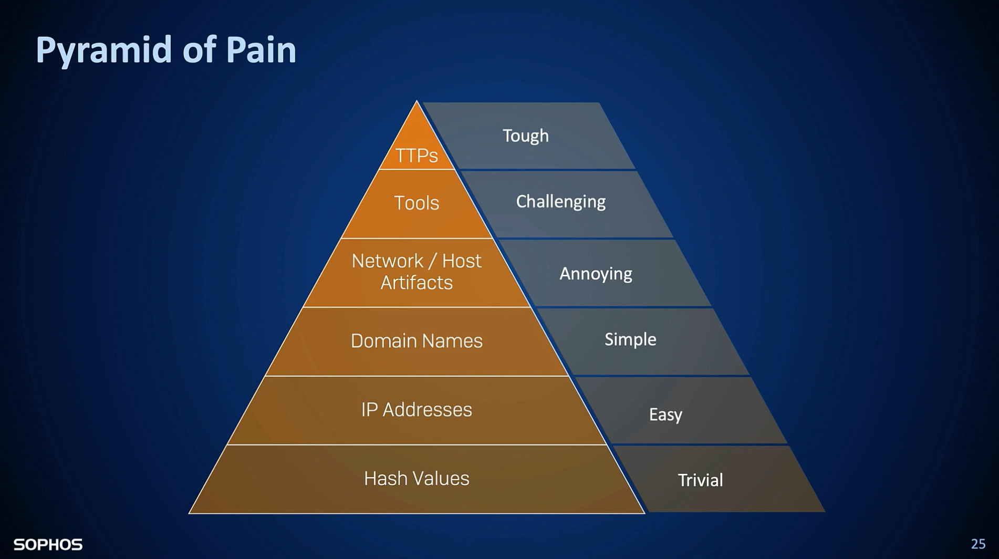
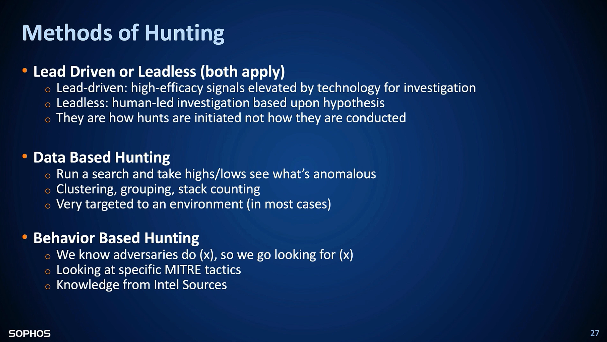
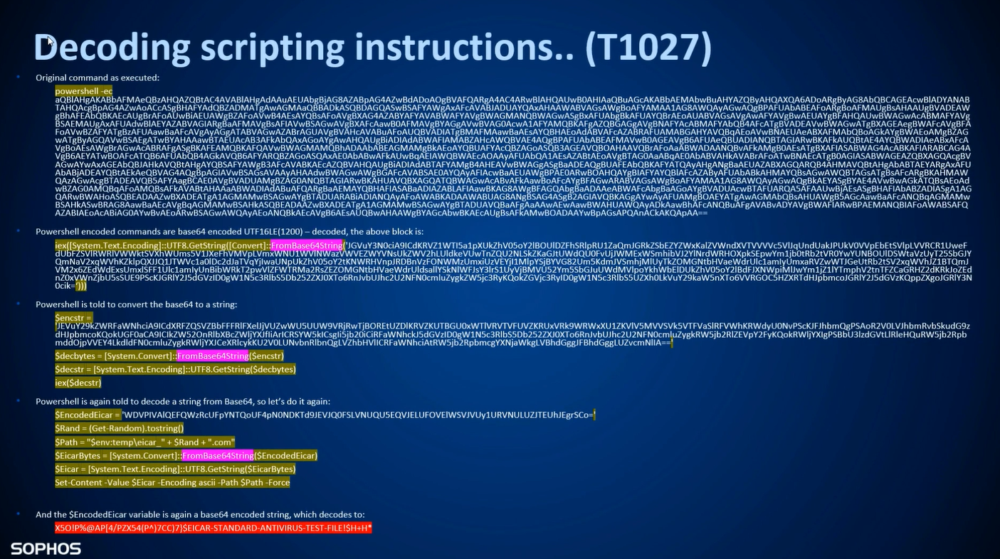
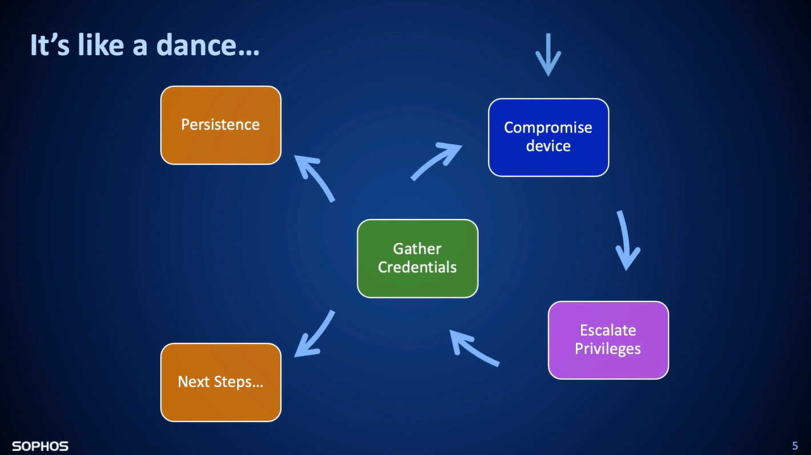
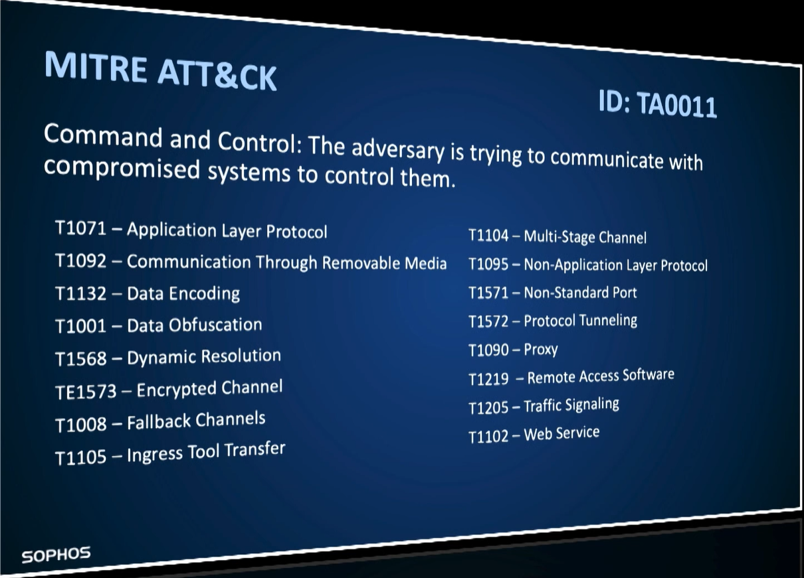
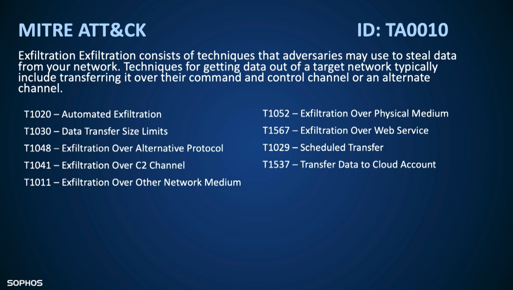

# Notes of Season 1 of [Sophos Threat Hunting Academy](https://events.sophos.com/threatacademyondemand)

## List of Tools
| Tool Name | Description (Used for) |
|-----------|------------------------|
| [CyberChef](https://gchq.github.io/CyberChef/) | For analysing and decoding data |
| [VirusTotla](https://virustotal.com) | OSINT for hashes, domains, files, IPs |
| [Shodan](https://shodan.io) | OSINT for IPs, i.e. banner grabbing, open ports, services |

## [1- Thinking Like a Threat Hunter](https://vimeo.com/519041491) <sub><sup>(Notes of the Session)</sup></sub>
- Threat Hunting: And iterative and _proactive_ process of searching through endpoints and network telemetry to _idenctify adversarial activity_, done so with the assumption that _adversaries have evaded defenses_.

- Get the hash of the file that helps us search for the hash in OSINT tools like VirusTotal without publishing the file on any public service.
```bash
# Windows Powershell
Get-FileHash file.ext

# Mac Terminal
shasum -a256 file.ext

# Linux Terminal
sha256sum file.ext
```
- Get the external IP address that can help us search it in tools like Shodan to find how intruders see our perimeter from the outside.
```Powershell
# Windows Powershell
Invoke-WebRequest -uri "http://ifconfig.me/ip"

# Mac & Linux Terminal
curl http://ifconfig.me/ip
```
- Treat Detection and Response (TDR)
  - Prevention
  - Collection
  - Prioritization
  - Investigation
  - Action

- There framework is used to do the threat hunting


- List of the IoCs we can hunt


### Hunting Methods
  - Lead Driven (leadless) hunting
  - Data-based hunting
  - Behavior-based hunting



## [2- Running Code On Remote Systems](https://vimeo.com/519181904) <sub><sup>(Notes of the Session)</sup></sub>
- Ususally a small code (stager/payload) runs at frist and later it downloads more codes to get completed.
- We can discover and block the repository

### Dealing with executable malicious files
- To analyze an `exe` file, we can
  - check the **connections to other hosts**
  - check if the file is signed or not
  - check if the hash of the file is found on different TIPs; if it is new, the newer (no result) the more suspicious
- Actions to take:
  - Isolate the system
  - Block/Clean the file or process
  - Block the connection from the IDS/IPS, EDR, or firewall
- If it is launched through other applications like _MS Word_ or _Outlook_, we can search for the history of accessing the file. It helps us to find who, when, and where the parent processes have launched the file or the script

### Dealing with scripting engines, i.e. Bash, PowerShell
- in this case, a command (script) will receive instructions from the attacker.
  - The instruction might come from a (local) file, streamed from the network
  - The instruction is usually in plain text (not compiled code) to make it less suspicious
  - Use the built-in function to learn about the Domain
  - Execute instructions on remote machines (`wsmprovhost.exe` is Windows Remote Powershell session that will be seen on the remote machine as a process/service)
  - The script is usually obfuscated and heavily coded
  - AMSI (Windows 10) sends all scripted instructions (command) to AVs that helps us to see activities

```PowerShell
# get the list of running tasks (services)
tasklist | more

# filter (search) on tasks
@ Filter Names: STATUS, IMAGENAME, PID, SESSIONNAME, MEMUSAGE, USERNAME, ...
tasklist /FI "IMAGENAME eq lsass.exe"

# kill a specific task
# by on the PID
taskkill /PID 123
# by name
taskkill /IM powershell.com
# by force
taskkill /F <THE-REST>
# terminate incuding all childs (it includes /F)
taskkill /T <THE-REST>

# example:
TASKKILL /PID 1230 /PID 1241 /IM cmd.exe /T
```

- To deal with encoded scripts, we need to decode it with tools like [CyberChef](https://gchq.github.io/CyberChef/), maybe multiple times by hand.


- Various ways to run commands remotely
  - **PSExec**
  - **Powershell**
    - `WSMProvHost.exe`
    - `EntterPSSession -ComputerName <host>`
    - `Invoke-Command -ComputerName <host> -Scriptblock {Start-Process C:\file.exe}`
  - **WMI**
    - `WMIPrvSE.exe`
    - `wmic /NODE:<host> process call create "file.exe"`
    - `Invoke-WmiMethod -Computer <host> -Class Win32_Process -Name create arugimet "C:\file.exe"`
    - `WMIPrvSE.exe -secured -Embedding`

### Hunting Methods
- check the called **processes** and **chain of processes** (parent and child-processes). It might be helpful if we sort the chain by time
  - Parent processes show us how it came to the network (origin)
  - Child processes show us what it did (damages)
- Search for commands with an **encoding** parameter. Then we can use decoding tools to find the actual command.
  - PowerShell encoding parameters
``` PowerShell
-e
-ec
-en
-encod
-enco
-EncodedCommand

IEX
-Invoke-Expression

frombase64string

# Ignore the commands in the profile file
-noprofile
-Nop

# bypassing/ignoring execution policy restriction
-ExecutionPolicy bypass
-Exec bypass

# hide the command window
-W Hidden
-WindowStyle Hidden

# no interactive shell
-NonI
-NonInteractive

# Execute a single liner command
-C
-Command

# Run commands from a file
-F
-File
```
- Search for the parent processes
- Search for the users who ran the command
- Search for remotely run commands
  - Search for commands with `WMIPrvSE.exe` and `WMIC.exe`
    - `WMIPrvSE.exe` as a parent process to scripting engines like `PowerShell.exe`, `CScript.exe`, `WScript.exe` that runs as **User** account
    - `WMIC.exe create <others>`
    - `WMIC.exe /node <others>`
  - Exclude legitimate commands
    - `WMIPrvSE.exe` launching a `.vbs` script from `C:\Windows\System32\CCM\SystemTemp`
    - Launching `dismhost.exe` out of `C:\Windows\temp\<GUID>\dismhost.exe`
    - Launching `MSIExec.exe`
    - Launching PowerShell scripts from `\CCM\` directory
    - Launching `Werfault.exe`
- Find the scope of what the execution chain did
- Some legitimate programs, use the encoding mechanism
- Search for hunting queries on the internet to do a happy hunt based on others experience
- Use the [SANS Hunt Evil poster](https://www.sans.org/posters/hunt-evil/) to get more idea about Windows Processes <sub>([local file, in case of changes on SANS site](img/hunt-evil.pdf))</sub>.


## [3- Threat Journey: Gaining A Privileged Foothold](https://vimeo.com/519471088) <sub><sup>(Notes of the Session)</sup></sub>
- _Access_ to an environment with a goal of _gaining and maintaining as much privilege_ as possible to be used by threat actors _performing adversarial activity_ is called **privileged foothold**.
- Attackers get the foothold to perform other activities.


### Hunting Methods
- Is RDP enabled? If the `data=0` for the following registry, RDP is enabled and if it is `1`, it means that RDP is disabled.
`HKEY_LOCAL_MACHINE\SYSTEM\CurrentControlSet\Control\Terminal Server`
  - We can disable RDP by the following command:
  ```PowerShell
  Reg add “\\computername\HKLM\SYSTEM\CurentControlSet\Control\Terminal Server”  /v fDenyTSConnections /t REG_DWORD /d 0 /f
  ```
- Check for any strange logons and signs of brute-force attacks.
- Check local users to see if they are active (enabled) or not; more specifically the `administrator` and `guest` users.
```PowerShell
Net USER <username>
```
- Look for any external services (RDP, SSH, etc.)
- Monitor used of system tools and the reason of the usage; i.e. `procdump`, `pskill`, `psexec`, `powershell`, `NTDSutil`, `sysinternals`, etc.
- Even though activities like `Ntdsutil` is a legitimate PowerShell tool (command) for any domain admin, it can be used by intruders too. The following table provides a list of such activities based on MITRE ATT&CK framework.

| Technique ID | Technique Name | IOC Type | Indicator |
|---|---|---|---|
| T???? | Memory loaded Software | cmdline | `%IEX (New-Object Net.WebClient).DownloadString%`  |
| T???? | Memory loaded Software | cmdline | `%SQBm%`  |
| T???? | Powershell Install | cmdline | `%download%powershell%`  |
| T1003 | Credential Dumping | cmdline | `%mimikatz%`  |
| T1003 | Credential Dumping | cmdline | `%dumpcreds%`  |
| T1003 | Credential Dumping | process | `%gsecdump.exe`  |
| T1003 | Credential Dumping | process | `%wce.exe`  |
| T1003 | Credential Dumping | cmdline | `%save hklm\sam%`  |
| T1003 | Credential Dumping | cmdline | `%save hklm\system%`  |
| T1003 | Credential Dumping | cmdline | `%save hklm\security%`  |
| T???? | process Dumping | process | `%procdump.exe`  |
| T1003 | Credential Dumping | cmdline | `%-ma lsass.exe%`  |
| T1003 | Credential Dumping | filepath | `c:\windows\temp\lsass_dump.dmp`  |
| T1003 | Credential Dumping | cmdline | `%C:\windows\System32\comsvcs.dll, MiniDump (Get-Process lsass).id $env:TEMP\lsass-comsvcs.dmp full%`  |
| T1003 | Credential Dumping | process | `%Outflank-Dumpert.exe`  |
| T1003 | Credential Dumping | process | `%mimikatz.exe`  |
| T1003 | Credential Dumping | cmdline | `lsass.dmp`  |
| T1003 | Credential Dumping | cmdline | `%ac i ntds%ifm%create full%`  |
| T1003 | Credential Dumping | process | `%ntdsutil%`  |
| T1003 | Credential Dumping | process | `%vssadmin.exe`  |
| T1003 | Credential Dumping | cmdline | `%create shadows /for=c:%`  |
| T1003 | Credential Dumping | cmdline | `%\\?\GLOBALROOT\Device\HarddiskVolumeShadowCopy1\Windows\NTDS\NTDS.dit%`  |
| T1003 | Credential Dumping | cmdline | `%\\?\GLOBALROOT\Device\HarddiskVolumeShadowCopy1\Windows\System32\config\SYSTEM%`  |
| T1003 | Credential Dumping | cmdline | `%/S cpassword %logonserver%\sysvol\*.xml%`  |
| T1003 | Credential Dumping | cmdline | `%Get-GPPPassword -Verbose%`  |
| T1003 | Credential Dumping | process | `%accesschk.exe`  |
| T1012 | query registry | process | `%reg.exe`  |
| T1012 | query registry | cmdline | `%HKLM\SOFTWARE\Microsoft\Windows NT\CurrentVersion\Windows%`  |
| T1012 | query registry | cmdline | `%HKLM\Software\Microsoft\Windows\CurrentVersion\RunServicesOnce%`  |
| T1012 | query registry | cmdline | `%HKCU\Software\Microsoft\Windows\CurrentVersion\RunServicesOnce%`  |
| T1012 | query registry | cmdline | `%HKLM\Software\Microsoft\Windows\CurrentVersion\RunServices%`  |
| T1012 | query registry | cmdline | `%HKCU\Software\Microsoft\Windows\CurrentVersion\RunServices%`  |
| T1012 | query registry | cmdline | `%HKLM\SOFTWARE\Microsoft\Windows NT\CurrentVersion\Winlogon\Notify%`  |
| T1012 | query registry | cmdline | `%HKLM\Software\Microsoft\Windows NT\CurrentVersion\Winlogon\Userinit%`  |
| T1012 | query registry | cmdline | `%HKCU\Software\Microsoft\Windows NT\CurrentVersion\Winlogon\\Shell%`  |
| T1012 | query registry | cmdline | `%HKLM\Software\Microsoft\Windows NT\CurrentVersion\Winlogon\\Shell%`  |
| T1012 | query registry | cmdline | `%HKLM\Software\Microsoft\Windows NT\CurrentVersion\Winlogon\Userinit%`  |
| T1012 | query registry | cmdline | `%HKLM\Software\Microsoft\Windows NT\CurrentVersion\Winlogon\Userinit%`  |
| T1012 | query registry | cmdline | `%HKLM\SOFTWARE\Microsoft\Windows\CurrentVersion\ShellServiceObjectDelayLoad%`  |
| T1012 | query registry | cmdline | `%HKLM\Software\Microsoft\Windows\CurrentVersion\RunOnce%`  |
| T1012 | query registry | cmdline | `%HKLM\Software\Microsoft\Windows\CurrentVersion\RunOnceEx%`  |
| T1012 | query registry | cmdline | `%HKLM\Software\Microsoft\Windows\CurrentVersion\Run%`  |
| T1012 | query registry | cmdline | `%HKLM\Software\Microsoft\Windows\CurrentVersion\Run%`  |
| T1012 | query registry | cmdline | `%HKCU\Software\Microsoft\Windows\CurrentVersion\RunOnce%`  |
| T1012 | query registry | cmdline | `%HKLM\Software\Microsoft\Windows\CurrentVersion\Policies\Explorer\Run%`  |
| T1012 | query registry | cmdline | `%HKCU\Software\Microsoft\Windows\CurrentVersion\Policies\Explorer\Run%`  |
| T1012 | query registry | cmdline | `%HKLM\system\currentcontrolset\services /s \| findstr ImagePath 2>nul \| findstr /Ri ".*\.sys$%`  |
| T1012 | query registry | cmdline | `%HKLM\Software\Microsoft\Windows\CurrentVersion\Run%`  |
| T1027 | Obfuscated Files or Information | cmdline | `%$OriginalCommand =%`  |
| T1027 | Obfuscated Files or Information | cmdline | `%[System.Text.Encoding]::Unicode.GetBytes%`  |
| T1027 | Obfuscated Files or Information | cmdline | `%[Convert]::ToBase64String%`  |
| T1027 | Obfuscated Files or Information | cmdline | `%EncodedCommand%`  |
| T1027 | Obfuscated Files or Information | cmdline | `%Set-ItemProperty -Force -Path HKCU%`  |
| T1027 | Obfuscated Files or Information | cmdline | `%-Command "IEX%`  |
| T1027 | Obfuscated Files or Information | cmdline | `%[Text.Encoding]::UNICODE.GetString([Convert]::FromBase64String%`  |
| T1028 | Windows Remote Management | cmdline | `%Enable-PSRemoting -Force%`  |
| T1028 | Windows Remote Management | cmdline | `%Document.ActiveView.ExecuteShellCommand%`  |
| T1028 | Windows Remote Management | cmdline | `%/user:DOMAIN\Administrator /password:%`  |
| T1028 | Windows Remote Management | process | `%wmic.exe`  |
| T1028 | Windows Remote Management | cmdline | `%HKLM\SOFTWARE\Microsoft\Windows NT\CurrentVersion\Image File Execution Options\osk.exe\%/v \%Debugger\% /t REG_SZ /d \%cmd.exe\% /f%`  |
| T1028 | Windows Remote Management | cmdline | `%\\localhost -u DOMAIN\Administrator -p%`  |
| T1028 | Windows Remote Management | process | `%psexec.exe`  |
| T1028 | Windows Remote Management | cmdline | `%invoke-command -ComputerName localhost -scriptblock {ipconfig}%`  |
| T1031 | Modify Existing Service | cmdline | `%binPath= %C:\windows\system32\WindowsPowerShell\v1.0\powershell.exe -noexit -c%`  |
| T1028 | Windows Remote Management | cmdline | `%invoke-command -ComputerName localhost -scriptblock {ipconfig}%`  |
| T1028 | Windows Remote Management | cmdline | `%invoke-command -ComputerName localhost -scriptblock {ipconfig}%`  |
| T1037 | Logon scripts | cmdline | `%ADD HKCU\Environment /v UserInitMprLogonScript /t REG_SZ /d%`  |
| T1037 | Logon scripts | cmdline | `%/sc onlogon /tr%`  |
| T1037 | Logon scripts | cmdline | `%$env:APPDATA\Microsoft\Windows\Start Menu\Programs\Startup%`  |
| T1037 | Logon scripts | cmdline | `%C:\ProgramData\Microsoft\Windows\Start Menu\Programs\StartUp%`  |
| T1048 | Exfiltration Over Alternative Protocol | cmdline | `%$ping = New-Object System.Net.Networkinformation.ping; foreach%`  |
| T1049 | System Network Connections Discovery | process | `%netstat.exe`  |
| T1049 | System Network Connections Discovery | process | `%net.exe`  |
| T1049 | System Network Connections Discovery | cmdline | `%Get-NetTCPConnection%`  |
| T1050 | Service Instalation | cmdline | `%New-Service -Name%`  |
| T1050 | Service Instalation | cmdline | `%Start-Service -Name%`  |
| T1053 | Scheduled Task | cmdline | `%/Create /SC ONCE /TN spawn /TR%`  |
| T1053 | Scheduled Task | process | `%schtasks.exe`  |
| T1053 | Scheduled Task | cmdline | `%/Create /S localhost /RU DOMAIN\user%`  |
| T1053 | Scheduled Task | cmdline | `%New-ScheduledTaskAction -Execute%`  |
| T1053 | Scheduled Task | cmdline | `%New-ScheduledTaskTrigger -AtLogon%`  |
| T1053 | Scheduled Task | cmdline | `%New-ScheduledTaskPrincipal -GroupId%`  |
| T1053 | Scheduled Task | cmdline | `%New-ScheduledTaskSettingsSet%`  |
| T1053 | Scheduled Task | cmdline | `%New-ScheduledTask -Action%`  |
| T1053 | Scheduled Task | cmdline | `%Register-ScheduledTask%`  |
| T1063 | Security Software Discovery | cmdline | `%\| findstr /i virus%`  |
| T1063 | Security Software Discovery | cmdline | `%\| findstr /i cb%`  |
| T1063 | Security Software Discovery | cmdline | `%\| findstr /i sophos%`  |
| T1063 | Security Software Discovery | cmdline | `%\| findstr /i defender%`  |
| T1063 | Security Software Discovery | cmdline | `%findstr.exe 385201%`  |
| T1063 | Security Software Discovery | cmdline | `%get-process \| ?{$_.Description -like "*virus*"}%`  |
| T1063 | Security Software Discovery | cmdline | `%get-process \| ?{$_.Description -like "*defender*"}%`  |
| T1063 | Security Software Discovery | cmdline | `%get-process \| ?{$_.Description -like "*sophos*"}%`  |
| T1063 | Security Software Discovery | cmdline | `%/Namespace:\\root\SecurityCenter2 Path AntiVirusProduct Get displayNam%`  |
| T1069 | Permission Groups Discovery | cmdline | `%localgroup%`  |
| T1069 | Security Software Discovery | cmdline | `%get-localgroup%`  |
| T1069 | Security Software Discovery | cmdline | `%group /domai% "Domain Admins"%`  |
| T1069 | Security Software Discovery | cmdline | `%groups "Account Operators" /doma%`  |
| T1069 | Security Software Discovery | cmdline | `%groups "Exchange Organization Management" /doma%`  |
| T1069 | Security Software Discovery | cmdline | `%group "BUILTIN\Backup Operators" /doma%`  |
| T1070 | Indicator Removal on Host | cmdline | `%cl System%`  |
| T1070 | Indicator Removal on Host | cmdline | `%usn deletejournal /D%`  |
| T1070 | Indicator Removal on Host | cmdline | `%Remove-Item C:\Windows\System32\winevt\Logs\Security.evtx%`  |
| T1070 | Indicator Removal on Host | cmdline | `%Clear-EventLog -logname%`  |
| T1531 | Account Removal | cmdline | `%user%/delete%` |


### Attack Ideas
- Run PowerShell or any other application as admin. It can be used when the user is on the local admin groups `BUILTIN\Administrators`.
```PowerShell
Start-Process powershell.exe -verb runas
```
- `LSASS.exe` stands for _Local Security Authority Subsystem Service_. If `lsass.exe` is one of the running tasks (services), it might get used for dumping NLTM hashes.
  - It can be done by `procdump.exe`
  ```
  procdump.exe -AccetEULA -r -ma <path to save dumped data; i.e. c:\dumped.dmp>
  ```
  
## [4- Threat Journey: Understanding the Target Environment](https://vimeo.com/521830943) <sub><sup>(Notes of the Session)</sup></sub>
- When attackers are in the network, they have no idea where they are landed. They need to discover the network and do the lateral movement
  - Account Discovery: Domain Account (T1087:002)
  ```PowerShell
  # discover local users
  Net USER
  # discover domain users
  Net USER /Domain
  #
  Net ACCOUNTS
  # discover domain group membership
  Net GROUP
  # discover local group membership
  Net LOCALGRPIP
  ```
  - Password Policy Discovery (T1201)
  - Network Service Scanning (T1046)
  ```PowerShell
  NSLookup.exe
  Hostname.exe
  IPConfig
  NetScan.exe
  nmap.exe
  .
  .
  .
  ```
  - File and Direcotory Discovery (T1083)
  - Remote Serivces (T1021)
    - RDP and VNC ports like `3389`, `5900`, `5800`
    - Search for remote script execution

  	| Command | Description |
    |---|---|
    |`Net.WebClient`||
    |`DownloadFile`||
    |`Invoke-WebRequest`||
    |`Invoke-Shellcode`||
    |`http:`||
    |`https:`||
  - Lateral Tools Transer (T1570)


## [5- Threat Journey: Remote Access Control](https://vimeo.com/521881254) <sub><sup>(Notes of the Session)</sup></sub>


- After gaining the foothold, there will be the Command and Control (C2) that finishes with data exfilteration


### Hunting Methods
- List all machines with open ports and check the process keeps it open; it can be combined with the destination IP and port. Some might be sneaky, i.e. `powershell.exe`, and some legit, i.e. `chrome.exe`
- After we find suspicious connections, we can find all connected machines to the suspicious destination IP
- Search on applications running on the network via firewall and the communication they make, i.e. `powershell.exe` that is connected to the internet
- Search for DNS traffic that is not connected to the trusted DNS servers, i.e. `8.8.8.8`. To overcome this attack, having an internal DNS server could be an option.
  - Check the Hex and ASCII of the packet to see if it is a legitimate DNS request or data exfiltration (packet inspection)
- Search on EDR/XDR, SIEM, and Firewall logs as well as running processes on devices to find any sign of exfiltration
- Monitor the activity of the known and legitimate web apps like _Dropbox_ or _GDrive_ for any sign of abnormality
- Search for the files that are touched by the malicious file (intruder). They can be found by the following commands

  | Command | Description |
  |---|---|
  |`Set-Location`||
  |`Set-StrictMode`||
  |`prompt`||
  |`System.Management.ManagementDateTimeConverter`||
  |`this.Runspace`||

  
### Attack Ideas and Tools
- `dnsteal.py` is a tool for data exfiltration over DNS
- `Metasploit`
- `Covenant`
- `PowerShell Empire`
- `Colbalt Strike`
- `Slingshot`

## [6- Using the EDR Threat Hunting Framework](https://vimeo.com/522371331) <sub><sup>(Notes of the Session)</sup></sub>


## Usefull Queries
- https://community.sophos.com/intercept-x-endpoint/p/query-forum
- https://www.sans.org/media/analyst-program/thinking-hunter-implementing-threat-hunting-program-38923.pdf
- https://docs.broadcom.com/doc/increased-use-of-powershell-in-attacks-16-en
