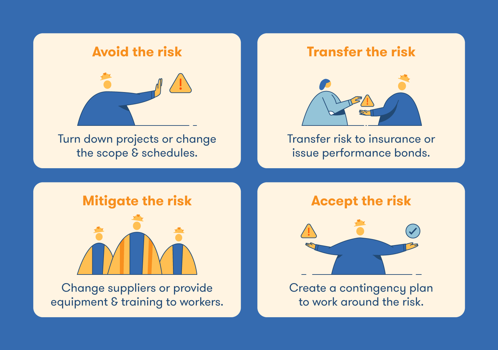
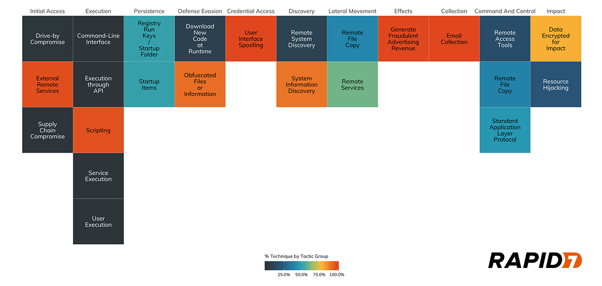
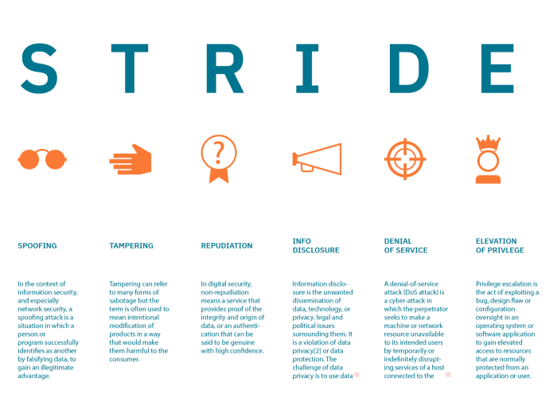
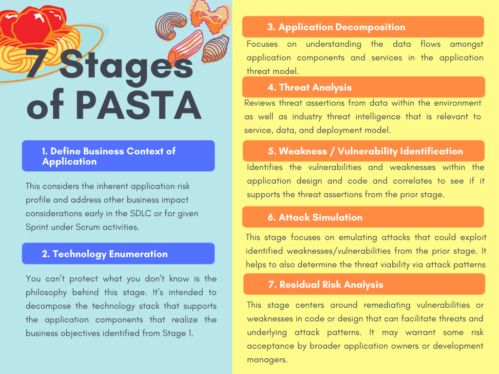
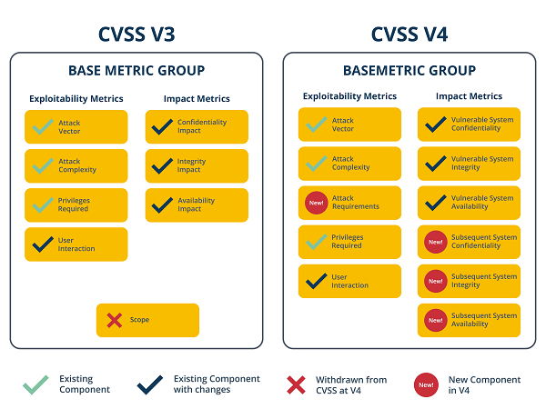
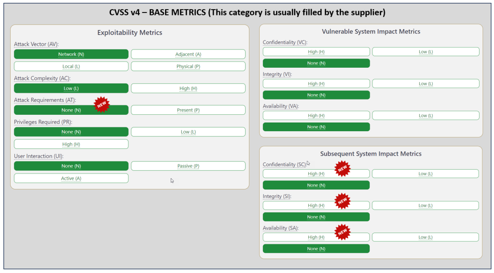
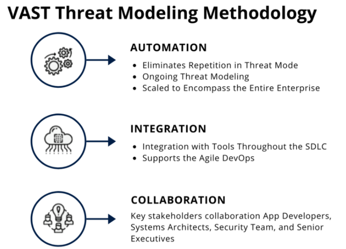
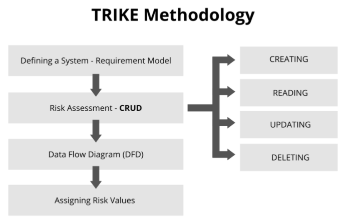

# Threat Modeling
Threat modeling is analyzing representations of a system to highlight concerns about security and privacy characteristics. In other words, threat modeling is the process of taking established or new procedures and assessing them for potential risks. This process can be adapted to any situation with potential risk, which many of us do daily. You can choose the more extended, well-lit walk to your car instead of the shortcut through the darkened alley. Looking both ways before crossing the street. This is something we often do by instinct.

**At the highest levels, when we threat model, we ask four key questions:**
- What are we working on?
- What can go wrong?
- What are we going to do about it?
- Did we do a good enough job?

**Threat modeling has the following key advantages:**
- Improved Visibility of Target of Evaluation (TOE): Threat modeling requires a deep understanding of the evaluated system. To correctly represent the threat model, one must understand data flows, trust boundaries, and other system characteristics.
- Increased Security Awareness: Proper threat modeling requires participants to think creatively and critically about the security and threat landscape of a specific application. It challenges individuals to "think like an attacker" and apply general security knowledge to a specific context.
- Identify Risks Early-On Threat modeling seeks to identify potential security issues during the design phase. This allows security to be "built into" a system rather than "bolted-on".
  - It helps development teams prioritize fixes to existing software according to the severity and impact of anticipated threats.
  - It helps prioritize threats, ensuring that resources and attention are distributed effectively. This prioritization can be applied during the planning, design, and implementation of security to ensure that solutions are as effective as possible.
 
# High-Level Process
Many threat modeling techniques, including LINDDUN, PASTA, STRIDE, TRIKE, VAST, and OCTAVE, have been developed and utilized effectively in the industry. There is no universally accepted industry standard for the threat modeling process and no "right" answer for every use case.
1. **Application Decomposition:** The step of application decomposition seeks to answer the question, "What are we building"? One must understand a system to understand what threats most apply to it truly; thus, this step provides a critical foundation for subsequent activities. Although different techniques may be used in this first step of threat modeling, data flow diagrams (DFDs) are arguably the most common approach.
2. **Threat Identification and Ranking:** After the system has been modeled, it is time to address the question of "what can go wrong?". I think this question must be explored with the inputs from the first step in mind; that is, it should focus on identifying and ranking threats within the context of the specific system being evaluated. In attempting to answer this question, threat modelers have many data sources and techniques. For illustration purposes, this cheatsheet will leverage STRIDE.
3. **Response and Mitigations:** Equipped with an understanding of both the system and applicable threats, it is now time to answer, "What are we going to do about it"?. Each threat identified earlier must have a response. Threat responses are similar, but not identical, to risk responses.

4. Review and Validation: Finally, it is time to answer the question, "Did we do a good enough job"? The threat model must be reviewed by all stakeholders, not just the development or security teams.

## Threat Modeling Tools
- [Cairis](https://github.com/cairis-platform/cairis)
- [draw.io (threat modeling libraries)](https://github.com/michenriksen/drawio-threatmodeling)
- [IriusRisk](https://www.iriusrisk.com/)
- [Microsoft Threat Modeling Tool](https://learn.microsoft.com/en-us/azure/security/develop/threat-modeling-tool)
- [OWASP's Threat Dragon](https://owasp.org/www-project-threat-dragon/)

## Threat Modeling Frameworks and Techniques
### MITRE ATT&CK Framework
MITRE ATT&CK is a “globally accessible knowledge base of adversary tactics and techniques based on real-world observations.” This framework is used in the development of threat models by providing a detailed outline of standard techniques used by cybercriminals to compromise businesses and organizations.

### STRIDE
STRIDE is a threat model created by Microsoft engineers that is meant to guide the discovery of threats in a system. It is used along with a model of the target system. This makes it most effective for evaluating individual systems.

STRIDE is an acronym for the types of threats it covers, which are:

- Spoofing — a user or program pretends to be another
- Tampering — attackers modify components or code
- Repudiation — threat events are not logged or monitored
- Information disclosure — data is leaked or exposed
- Denial of service (DoS) — services or components are overloaded with traffic to prevent legitimate use
- Elevation of Privilege — attackers grant themselves additional privileges to gain greater control over a system

### Process for Attack Simulation and Threat Analysis (PASTA)
PASTA is an attacker-centric methodology with seven steps. It is designed to correlate business objectives with technical requirements. PASTA's steps guide teams to dynamically identify, count, and prioritize threats.

The steps of a PASTA threat model are:

- Define business objectives
- Define the technical scope of assets and components
- Application decomposition and identify application controls
- Threat analysis based on threat intelligence
- Vulnerability detection
- Attack enumeration and modeling
- Risk analysis and development of countermeasures

### Common Vulnerability Scoring System (CVSS)
CVSS is a standardized threat scoring system used for known vulnerabilities. It was developed by the National Institute of Standards and Technology (NIST) and maintained by the Forum of Incident Response and Security Teams (FIRST).

This system is designed to help security teams access threats, identify impacts, and identify existing countermeasures. It also helps security professionals assess and apply threat intelligence reliably developed by others.

CVSS accounts for the inherent properties of a threat and the impacts of the risk factor due to time since the vulnerability was first discovered. It also includes measures that allow security teams to modify risk scores based on individual system configurations specifically.

### Visual, Agile, and Simple Threat (VAST)
Visual, Agile, and Simple Threat (VAST) is an automated threat modeling method built on the ThreatModeler platform. Large enterprises implement VAST across their infrastructure to generate reliable, actionable results and maintain scalability.

VAST can integrate into the DevOps lifecycle and help teams identify various infrastructural and operational concerns. Implementing VAST requires the creation of two types of threat models: 

- Application threat model — uses a process-flow diagram to represent the architectural aspect of the threat
- Operational threat model — uses a data-flow diagram to represent the threat from the attacker's perspective

### Trike
Trike is a security audit framework for managing risk and defense through threat modeling techniques. Trike allows a system, and an analyst enumerates the system's assets, actors, rules, and actions to build a requirement model. Trike generates a step matrix with columns representing the assets and rows representing the actors. Every matrix cell has four parts to match possiballowing (create, read, update, and delete) and a rule tree — the analyst specifies what is allowed, disallowed, or allowed with rules. 

Trike builds a data-flow diagram mapping each element to the appropriate assets and actors with defined requirements. The analyst uses the chart to identify denial of service (DoS) and privilege escalation threats.

Trike assesses attack risks using a five-point probability scale for each CRUD action and actor. It also evaluates actors based on their permission level for each step (constantly, sometimes, or never).

### Attack Trees
Attack trees are charts that display the paths attacks can take in a system. These charts depict attack goals as a root with possible paths as branches. When creating trees for threat modeling, multiple trees are designed for a single system, one for each attacker goal.

This is one of the oldest and most widely used threat modeling techniques. While once used alone, it is frequently combined with other methodologies, including PASTA, CVSS, and STRIDE.

### Hybrid Threat Modeling Method (hTMM)
hTMM is a methodology developed by Security Equipment Inc. (SEI) that combines two other methods:

- Security Quality Requirements Engineering (SQUARE) — a methodology designed to elicit, categorize, and prioritize security requirements
- Persona non-Grata (PnG) — a methodology that focuses on uncovering ways a system can be abused to meet an attacker's goals

hTMM is designed to enable threat modeling, which accounts for all possible threats, produces zero false positives, provides consistent results, and is cost-effective.

It works by applying Security Cards, eliminating unlikely PnGs, summarizing results, and formally assessing risk using SQUARE.

------
Resources:
- [Threat Modeling](https://about.gitlab.com/handbook/security/threat_modeling/)
- [Top 8 Threat Modeling Methodologies and Techniques](https://www.exabeam.com/information-security)
- [Threat Modeling](https://medium.com/dark-roast-security/threat-modeling-the-short-version-5b70ba96cea8)
- [Threat Modeling Manifesto](https://www.threatmodelingmanifesto.org/)
- [Awesome Threat Modeling](https://github.com/hysnsec/awesome-threat-modelling)
