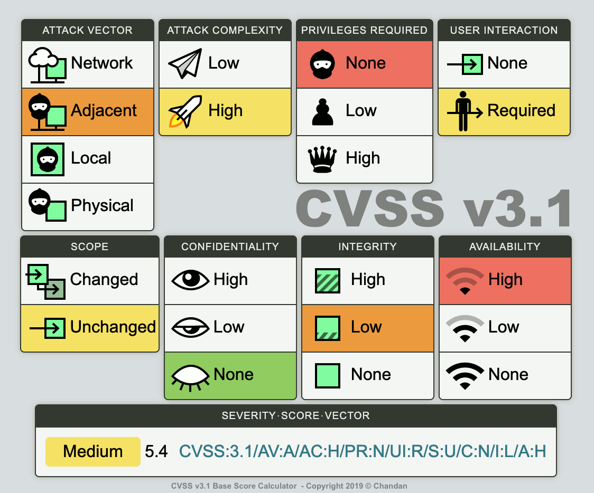

# Threat Modeling
Threat modeling is the process of taking established or new procedures, and then assessing it for potential risks. This process can be adapted to any situation where there is a potential risk, and is something that many of us do every day. Choosing the longer well-lit walk to your car as opposed to the short cut through the darkened alley. Looking both ways before crossing the street. This is something we often do by instinct.

Threat modeling has the following key advantages:

- Helps prioritize threats, ensuring that resources and attention are distributed effectively. This prioritization can be applied during planning, design, and implementation of security to ensure that solutions are as effective as possible.
- Ensures defenses are in line with evolving threats. If not, new threats may remain undefended, leaving systems and data vulnerable.
- Helps teams adopt or develop new tools or create software. It helps teams understand how tools and applications may be vulnerable in comparison to what protections are offered.
- Helps development teams prioritize fixes to existing software, according to the severity and impact of anticipated threats.

## MITRE ATT&CK Framework
MITRE ATT&CK is a “globally-accessible knowledge base of adversary tactics and techniques based on real-world observations.” This framework is used in the development of threat models by providing a detailed outline of common techniques used by cybercriminals to compromise businesses and organizations.

## Threat Modeling Frameworks
There are six main methodologies you can use while threat modeling: STRIDE, PASTA, CVSS, attack trees, Security Cards, and hTMM. Each of these methodologies provides a different way to assess the threats facing your IT assets.

### STRIDE
STRIDE is a threat model, created by Microsoft engineers, which is meant to guide the discovery of threats in a system. It is used along with a model of the target system. This makes it most effective for evaluating individual systems.

STRIDE is an acronym for the types of threats it covers, which are:

- Spoofing — a user or program pretends to be another
- Tampering — attackers modify components or code
- Repudiation — threat events are not logged or monitored
- Information disclosure — data is leaked or exposed
- Denial of service (DoS) — services or components are overloaded with traffic to prevent legitimate use
- Elevation of Privilege — attackers grant themselves additional privileges to gain greater control over a system

### Process for Attack Simulation and Threat Analysis (PASTA)
PASTA is an attacker-centric methodology with seven steps. It is designed to correlate business objectives with technical requirements. PASTA's steps guide teams to dynamically identify, count, and prioritize threats.

The steps of a PASTA threat model are:

- Define business objectives
- Define the technical scope of assets and components
- Application decomposition and identify application controls
- Threat analysis based on threat intelligence
- Vulnerability detection
- Attack enumeration and modeling
- Risk analysis and development of countermeasures

### Common Vulnerability Scoring System (CVSS)
CVSS is a standardized threat scoring system used for known vulnerabilities. It was developed by the National Institute of Standards and Technology (NIST) and maintained by the Forum of Incident Response and Security Teams (FIRST).

This system is designed to help security teams access threats, identify impacts, and identify existing countermeasures. It also helps security professionals assess and apply threat intelligence developed by others in a reliable way.

CVSS accounts for the inherent properties of a threat and the impacts of the risk factor due to time since the vulnerability was first discovered. It also includes measures that allow security teams to specifically modify risk scores based on individual system configurations.

### Visual, Agile, and Simple Threat (VAST)
Visual, Agile, and Simple Threat (VAST) is an automated threat modeling method built on the ThreatModeler platform. Large enterprises implement VAST across their entire infrastructure to generate reliable, actionable results and maintain scalability.

VAST can integrate into the DevOps lifecycle and help teams identify various infrastructural and operational concerns. Implementing VAST requires the creation of two types of threat models: 

- Application threat model — uses a process-flow diagram to represent the architectural aspect of the threat
- Operational threat model — uses a data-flow diagram to represent the threat from the attacker’s perspective

### Trike
Trike is a security audit framework for managing risk and defense through threat modeling techniques. Trike defines a system, and an analyst enumerates the system’s assets, actors, rules, and actions to build a requirement model. Trike generates a step matrix with columns representing the assets and rows representing the actors. Every matrix cell has four parts to match possible actions (create, read, update, and delete) and a rule tree — the analyst specifies whether an action is allowed, disallowed, or allowed with rules. 

Trike builds a data-flow diagram mapping each element to the appropriate assets and actors with the requirements defined. The analyst uses the diagram to identify denial of service (DoS) and privilege escalation threats.

Trike assesses attack risks using a five-point probability scale for each CRUD action and actor. It also evaluates actors based on their permission level for each action (always, sometimes, or never).

### Attack Trees
Attack trees are charts that display the paths that attacks can take in a system. These charts display attack goals as a root with possible paths as branches. When creating trees for threat modeling, multiple trees are created for a single system, one for each attacker goal.

This is one of the oldest and most widely used threat modeling techniques. While once used alone, it is now frequently combined with other methodologies, including PASTA, CVSS, and STRIDE.

### Hybrid Threat Modeling Method (hTMM)
hTMM is a methodology developed by Security Equipment Inc. (SEI) that combines two other methodologies:

- Security Quality Requirements Engineering (SQUARE) — a methodology designed to elicit, categorize and prioritize security requirements
- Persona non Grata (PnG) — a methodology that focuses on uncovering ways a system can be abused to meet an attacker’s goals

hTMM is designed to enable threat modeling which accounts for all possible threats, produces zero false positives, provides consistent results, and is cost-effective.

It works by applying Security Cards, eliminating unlikely PnGs, summarizing results, and formally assessing risk using SQUARE.

------
Resources:
- [Threat Modeling](https://about.gitlab.com/handbook/security/threat_modeling/)
- [Top 8 Threat Modeling Methodologies and Techniques](https://www.exabeam.com/information-security)
- [Threat Modeling](https://medium.com/dark-roast-security/threat-modeling-the-short-version-5b70ba96cea8)