# 1. Digital Forensics Overview
## Consept
- **Investigating** a digital device means trying to understand/interpret the data created by that digital device
- **Forensic Computing**: anything related to computing that may be needed in a court (as part of a trial, not the support of court processes)
- Digital forensics primarily supports law enforcement: **Criminal Prosecutions** (focused on punishment) and **Civil Litigations** (focused on dispute resolution)
- Digital Forensics Branches
  - Computer Forensics
    - It may not be feasible to “image/clone” large computer systems → some sort of selection has to be made
  - Web Browser Forensic
    - Web browser forensic concerns with the reconstruction of users activities based on evidence from one or more browsers such as cache and browsing history
  - Database Forensics
    - Database forensics concerns with the analysis of databases and their related metadata
  - Network Forensics
    - Network Forensics concerns with the investigation of computer network traffic, both local (LAN) and external (WAN)
    - Data on networked systems are highly dynamic & volatile
    - Investigators rely on packet sniffers, and several types of logs (e.g., from router, firewall, Intrusion Detection Systems)
  - Internet Forensics
    - Internet forensics concerns with the gathering of information or reconstruction of activities from Internet services such as social networks, chat rooms, newsgroups, blogs, video/image sites
    - Criminals often take advantage of online anonymity hindering investigations
  - Image and Video Forensics
    - Image and video forensics concerns with the analysis of devices and data from a variety of cameras, e.g., mobile phone cameras, hand-held video cameras and CCTVs
  - Mobile Device Forensics
    - Mobile forensics concerns with the investigation of mobile devices such as mobile phones, smartphones, GPS devices and tablets
  - Cloud Forensics
    - Concerns the investigation of cloud computing environments. Cloud computing is defined as “a model for enabling ubiquitous, convenient, on 231 demand network access to a shared pool of configurable computing resources”
    - Cloud services only offer remote access to a logical representation of data, rather than to the underlying physical infrastructure
    - Cloud providers use multi-tenant distributed file systems, meaning that a customer’s data may not be stored in a single location
    - Obtaining the physical device is unfeasible: time consuming, disruptive and access to non-relevant data has legal implications
    - Requesting an image from the cloud provider means that the investigator has no control over the evidence audit trail (chain of custody issue)

## Handling Digital Evidence
- There are two really important documents
  - **ACPO** Good practice guide for handling electronic evidence
  - **ISO 27037** – Information Technology – Security Techniques – Guidelines for identification, collection, acquisition and preservation of digital evidence

# 2. The Internet
## General Structure
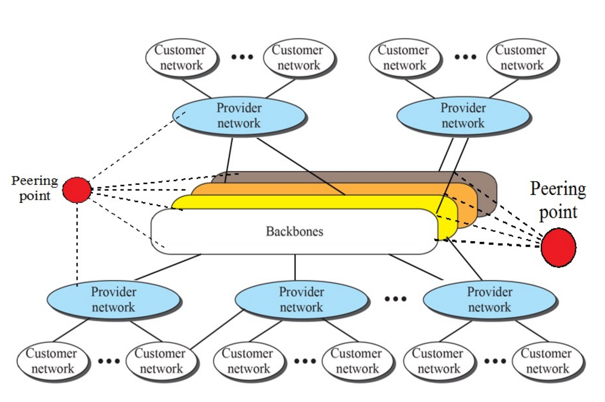
- The Internet is made up of several backbones
- Backbones are connected to each other using peering points
- At the end of the interconnected network is the end-user computer or network

## Webserver Sessions
- Webserver (HHTP) transactions are a ‘stateless request/response’ process that means the webserver does not remember previous connections
- A cookie is a small block of data sent during a HTTP web server request
  - It is sent to and from the web server as part of the HTTP data packet
  - It contains a ‘session ID’ – a number that is used to identify a single session 
  - The web server also retains a list of session IDs
  - Some server-based programming languages automate this process
- When the session ID is sent to the web server it remembers the previous actions of the end user

# 3. File Systems
## Boot Process and Partitions
- When a user turns on the computer, the computer, firstly, gets all hardware up and running, then gets the OS up and running
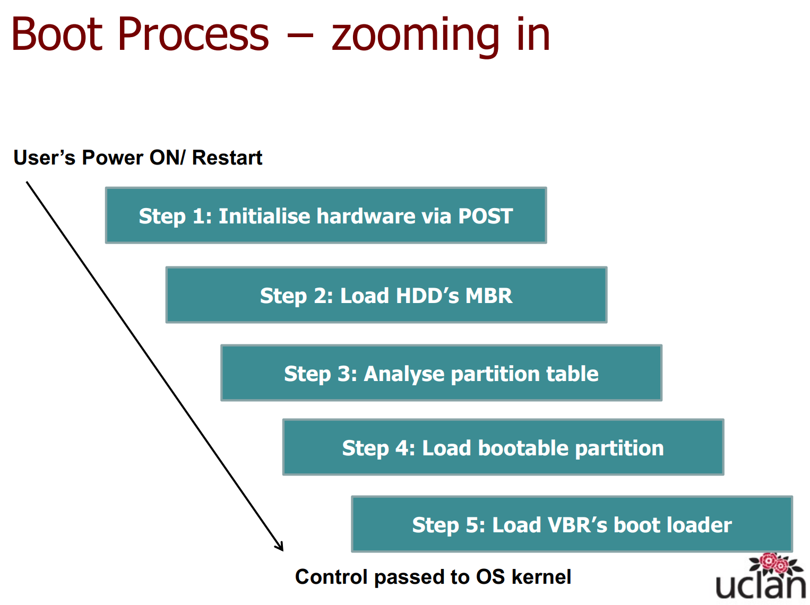

### Step 1: Power On Self Test (POST)
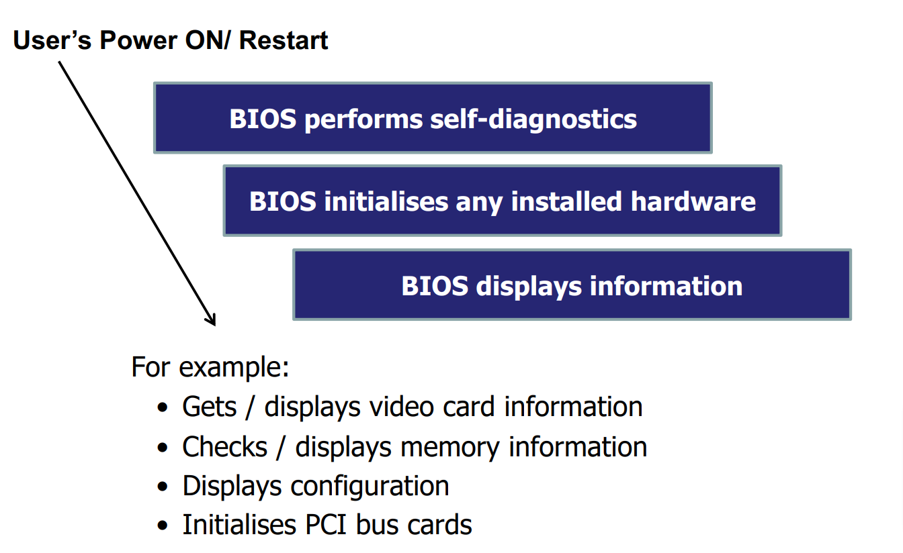
- If the diagnosis reports an error, a beep code is played
- Beep codes are not standardised

### Step 2: Load Master Boot Record
- If there is no failure on hardware devices (output from POST), BIOS loads the HDD's master boot record (MBR)
- The BIOS will load the data from sector 0 (physical address) and will pass this onto the CPU
- If the MBR contains boot code (i.e., a computer program), it will execute that code and if it contains nothing, it will do nothing and stop the process

#### Master Boot Record
- A correctly formatted MBR contains:
  - boot code
  - a partition table
  - a signature value
- A partition table is a data structure that represents areas of a HDD
  - This data structure is 64-bytes long
  - The partition table contains four 16-byte records
    - These records are known as partition records
    - Each 16-byte record defines 1 partition
    - When there are fewer than four partitions on a disk, the remaining partition table fields are set to the value 0
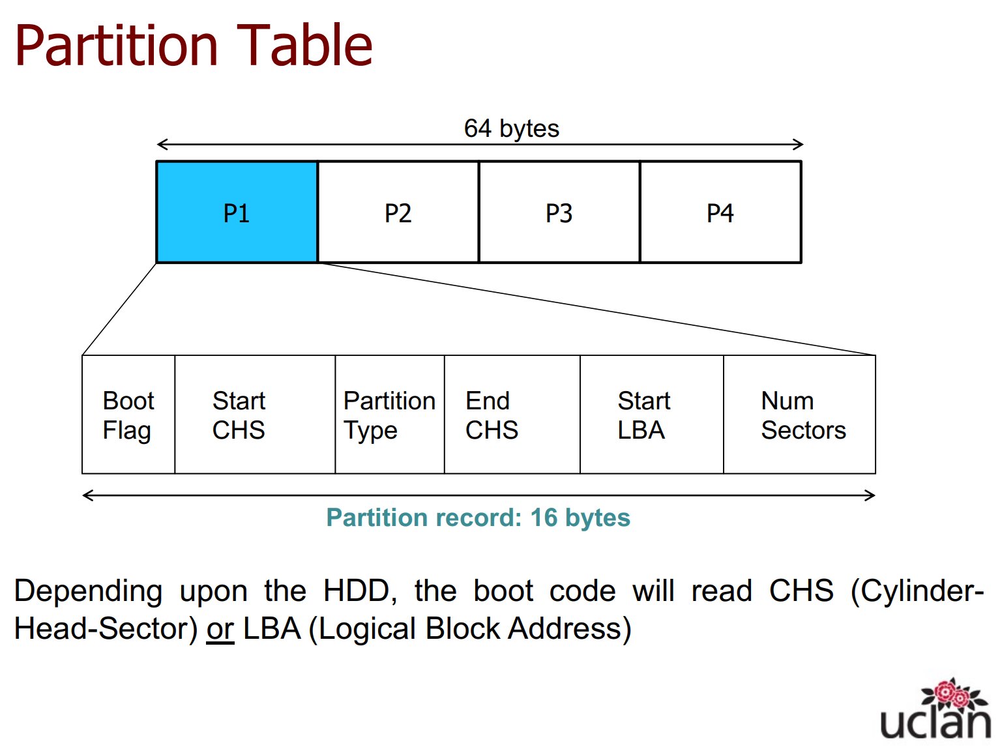
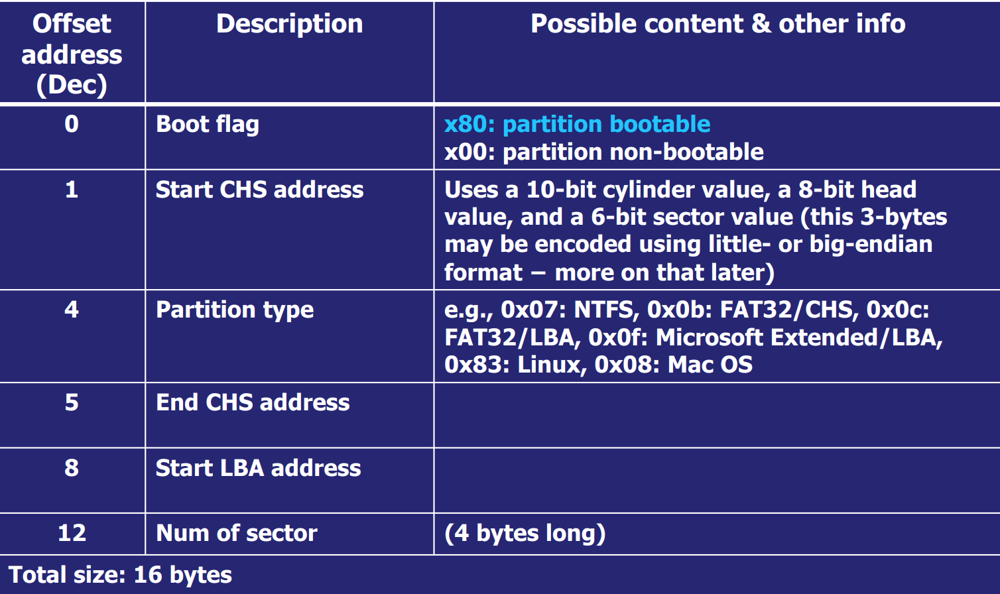

### Step 3: Analyse partition table
- The boot code held within the MBR will examine each of the partition records within the partition table, i.e., the partition record where the boot flag = 0x80
  - Boot code identifies the bootable partition
  - Boot code gets the disk address for the starting sector of the bootable partition
  - Boot code reads that starting sector from memory and passes it to the CPU

### Step 4: Load bootable partition
- CPU loads a bootable partition
- CPU reads the partition’s Volume Boot Record (VBR)
- The VBR is the first sector on an individual partition
- The VBR contains information that is needed for the file system to operate correctly. It contains, e.g., the number of sectors per cluster and the location of the root directory. It also contains a computer program (boot loader).

### Step 5: Load VBR’s boot loader
- CPU loads and executes the VBR’s boot loader
- VBR’s boot loader loads OS into memory
- The control of the computer is turned over to the OS
- The code in the VBR is invoked either directly by the BIOS or indirectly by code in the MBR or a boot manager

## Boot Process
- The boot process makes use of two boot records:
  - A **Master Boot Record (MBR)** is the first sector of a HDD. It may contain code to locate the active partition and invoke its VBR
  - A **Volume Boot Record (VBR)** is the first sector of an individual partition on a HDD that has been partitioned. It may contain code to load and invoke an OS installed within that partition

## Partitions
- A computer can have lots of different partitions, yet a partition table within the MBR has room for only four 16-bytes partition records
- Using different “partition types”, we can link together a list of “partition records”: 
  - **Primary partition**: A primary partition has its record written to the MBR partition table (there is a maximum of 4 primary partitions)
  - **Extended partition**: An extended partition is not an actual partition an extended partition is used to hold up to 4 logical or other extended partitions
  - **Logical (or secondary) partitions**: A logical partition is created within an extended partition and can be used to store data

### Extended Partitions
- The first sector of an extended partition holds another partition table
- This partition table contains space for four 16-bytes partition records. However, it is only allowed to use two partition entries

### Hiding Data
- Windows will only “mount” Windows partitions – e.g. FAT32 or NTFS
- Changing the partition type code (with a hex editor) will hide the entire partition from Windows

### Physical and Offset Addresses
- An offset address is an address relative to the start of something else
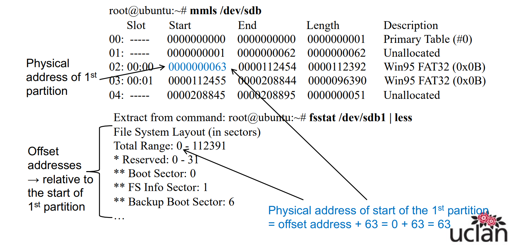

## File Systems
- Digital forensic investigations deal with media analysis, i.e., the analysis of files on media 
  - deleted files, files in directories/folders, files in other files
  - all stored on or in some container of a storage device

### What is a File System?
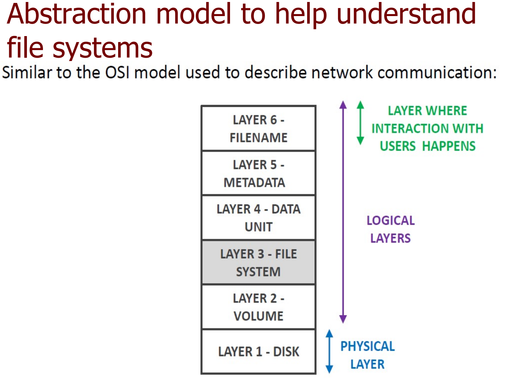
- A file system is a management system and an abstraction to store, access and update files. It is responsible for:
  - **Disk Management**: control of access to files, organisation of files logically (in directories), management of file metadata, and allocation of disk space
  - **Naming**: translation between filenames and storage locations
  - **Protection**: permission & restriction of access to files
  - **Reliability**: resilience to hardware failures allowing recovery from crashes, abnormal events etc

#### Layer 1: Disk
- Refers to the physical storage device, e.g., hard drives, SD cards, Solid State Disks
- Physical disk analysis requires very specialised equipment. Logical disk analysis is therefore the most common type of analysis performed by forensic investigators

##### Hard Disk
- Some components of a hard disk are:
  - **Platter**: fixed disk within a HD
  - **Tracks**: large sections that completely circle the platter
  - **Sectors**: sections on a track
  - **Cluster or Block**: fixed number of sectors
  - **Cylinder**: tracks of the same diameter on each platter

#### Layer 2: Volume
- A volume is created using all or part of one or more disks
- A single disk may contain several volumes, or a volume may span several disks, depending on configuration

#### Layer 3: File system
- A single disk may contain several volumes, or a volume may span several disks, depending on configuration

#### Layer 4: Data Unit
- Smallest available unit of data storage in a given file system
  - In Unix-based systems, this is called block
  - In Windows-based systems, this is called cluster
- Information available at this layer is the content of the data unit, e.g. if the data unit was allocated to a JPEG image → the data unit will contain JPEG data
- Traditionally the smallest addressable unit of a disk is 512 bytes
- Nowadays, it can be 4096 bytes (4K) or more

#### Layer 5: Metadata
- Metadata refers to data about data
- Given that a data unit layer holds data in a file system, the metadata contains data about the data units

#### Layer 6: Filename
- This is the layer where humans operate
- This layer consists of file and folder/directory names

### Examples of File Systems
- Disk file systems
  - Microsoft OS supports one of two families: FAT and NTFS
  - Linux OS supports several file systems: UFS, ext2, ext3, ext4, Reiser
  - Mac OS uses HFS and HFS+
- Flash file systems
  - It is designed for special abilities, performance & restrictions of flash memory devices, e.g. Android OS uses YAFFS, ext4 file systems
- Network file systems
  - It is distributed file systems allowing a user on a client computer to access files over a network
    - Network File System NFS (common for access to Linux, Unix systems)
    - SMB (common for access to Windows systems)

#### File Allocation Table (FAT) File System
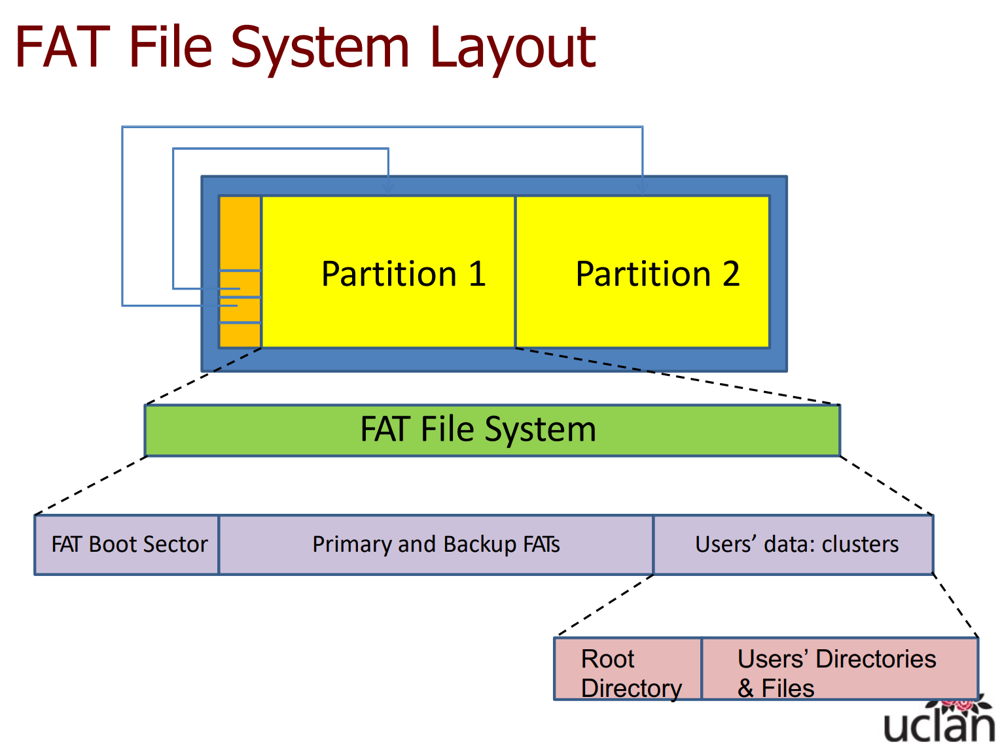
- FAT has been used in MS-DOS, floppy disks, and early Windows, such as Windows 3x, 95 and 98. It is currently still used on removable storage devices
- A FAT formatted partition uses directories and a file allocation table to organize files and folders
- Cluster sizes in FAT file systems
  - For FAT12 → cluster sizes range from 512 Bytes to 8KB
  - For FAT16 → cluster sizes range from 512 Bytes to 64KB
  - For FAT32 → cluster sizes range from 512 Bytes to 32KB
  - For exFAT → cluster sizes range from 4KB to 128KB

#### New Technology File System (NTFS) File System
- NTFS is the default file system in newer Windows
- NTFS has a number of advantages over FAT, e.g.:
  - Improved security: supports ability to set permissions on files & folders via Access Control Lists (ACLs)
  - Improved space efficiency: supports compression
  - It supports journaling
- In NTFS everything is a file
- There are files which contain administrative information (file system metadata files), and there are users’ data files
  - Name convention for administrative files: $ + First capital letter
  - Name convention for files’ attributes: $ + All capital letters
- The file Master File Table (MFT) contains information about all files and directories. It stores most of the information needed to locate data on the disk
  - The MFT has at least one record corresponding to each and every user file (including directories) stored on the HDD formatted with NTFS
  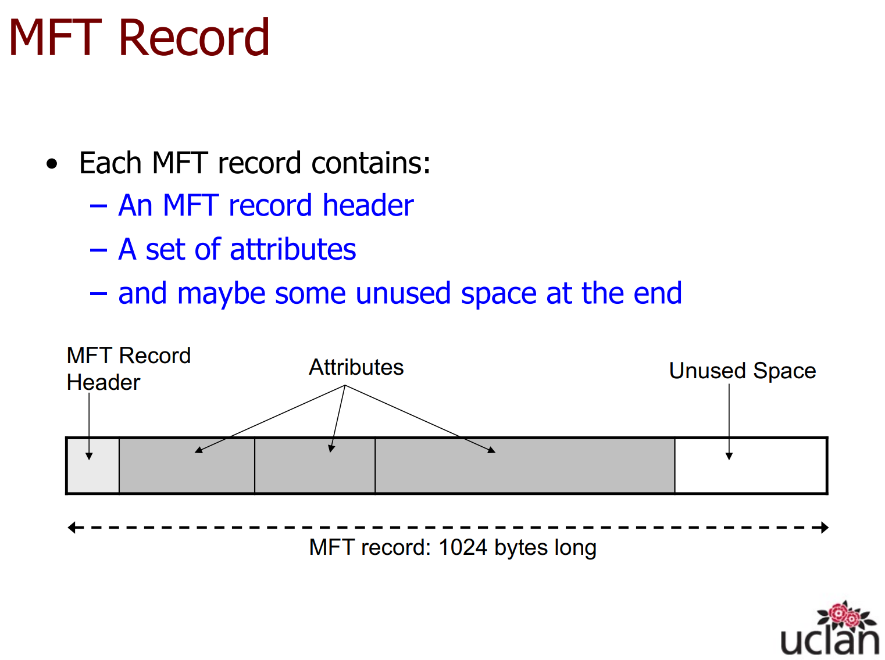
    - NTFS considers everything on the HDD to be a file, or part of a file
    - Directories are a special kind of file. A directory under NTFS is a list of filenames with corresponding MFT record pointers

#### Unix file systems
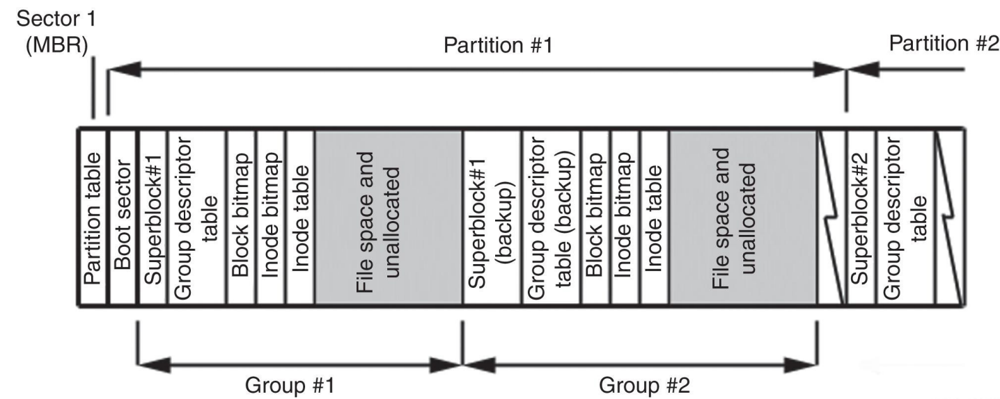
- In Unix file systems everything is a file
  - File types include regular file, directory, symbolic link (file which references another file) and socket (file used for inter-process communication)
  - Every file is associated with an inode (index node)
  - Every inode is identified by an inode number
  - The inode number indexes a table of inodes
- Each partition is divided into block groups, each with its inodes and data blocks → this is called compartmentalization
- Compartmentalizing data prevents catastrophic file system damage → no single point of failure

# 4. Evidence Acquisition and Challenges
- Evidence is information used to support a fact
- Characteristics of Digital Evidence
  - is latent (present but not visible), unlike a bullet
  - is volatile: prone to change
  - is fragile: easily altered, damaged or destroyed
  - crosses jurisdictional borders quickly and easily
  - can be time sensitive

## Direct versus circumstantial evidence
- Direct evidence establishes a fact.
- Circumstantial evidence suggests a fact.
- For example, A computer access log is a direct evidence that a given account was used to log into a computer at a certain time. But the access log is a circumstantial evidence that the individual who owns the account was responsible for any wrongdoing using it

## Standards for Digital Evidence Handling
- Investigators should be able to describe procedures, explain decisions and justify any course of action
- Evidence handling includes collection and acquisition of digital evidence

### ACPO Guidelines
- ACPO is based on 4 principles:
  - Principle 1 – No data should be altered
  - Principle 2 – A person must be competent in order to access original data; they must also be able to give evidence explaining the relevance and implications of their actions
  - Principle 3 – Audit trail should be created so that an independent third party can achieve the same results
  - Principle 4 – The person in charge of the investigation (the case officer) is responsible for ensuring these principles are adhered to

### ISO 27037:2012
- Digital evidence should be
  - Relevant: Potential evidence collected should contain information of value for the investigation, and there should be good reason for it to be acquired
  - Reliable: Digital evidence should be what it is “supposed” to be
  - Sufficient: Enough potential digital evidence should be collected to allow a proper investigation/examination to be carried out
- There are 4 key requirements in digital evidence handling that investigators should comply with (ISO
27037:2012): Auditability, Justifiability, and Repeatability or Reproducibility, depending on particular
circumstances

#### Auditability
- It should be possible for an independent assessor or other authorised interested parties to evaluate the activities performed by an investigator
- Investigators should document all activities performed • This allows 3rd parties to evaluate (i.e. audit) them (remember ACPO Principle 3: Audit trail?)

#### Justifiability
- The investigator should be able to justify all actions and methods used in handling the potential digital evidence; this can be demonstrated, e.g. by showing that the decision to get all the potential evidence was the best choice, or by successfully reproducing or validating the actions and methods
used

#### Repeatability
- It should be possible for an independent assessor or other authorised interested parties to repeat or reproduce tasks performed during an investigation under the following conditions:
  - using the same measurement procedures and methods
  - using the same instruments and under the same conditions
  - can happen at any time after the original test

#### Reproducibility
- It should be possible to obtain the same acquisition results on a different testing environment (e.g., different computer), given that the applicable conditions are provided (e.g., hardware/software specification of the computer) under the following conditions:
  - using the same measurement procedures and methods
  - using different instruments and under different conditions
  - can happen at any time after the original test

## Admissibility of Evidence
- In practice, admissibility is a set of legal tests carried out by a judge to assess an item of evidence

### Tests to Assess Admissibility
#### Relevance and reliability
- Examining the digital evidence for traces of tampering, deletion or other damage
- Examining whether the system source of the digital evidence (or the process used) produces accurate results
- *Example*: whether the computer that generated the evidence was functioning properly

#### Authenticity
- Satisfying the court that
  - the digital evidence was acquired from a specific system and/or location,
  - a complete and accurate copy of the digital evidence was acquired, and
  - the digital evidence remained unchanged since it was collected.
- Two documents are important to demonstrate authenticity of digital evidence:
  - Chain of custody
  - Integrity documentation
##### Chain of Custody
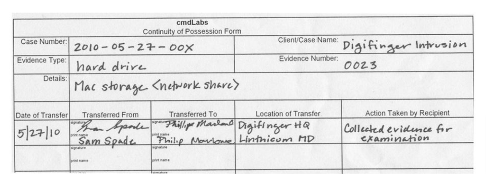
- A document which records the transfer of evidence. It should provide the chronology of the movement and handling of the potential digital evidence up to the present status and location
- Data should fill the integrity. It means that the digital fingerprint (hash; e.g. MD5 or SHA-1) shuold be the same for the initial state (during the data collection) and the current one
  - Hashing procedure is as follows:
    - Perform evidence acquisition
    - Generate hash number of evidence file
    - Write hash number on chain of custody
    - if any process is done on the evidence, e.g. being opened in forensic tools:
      - Regenerate hash number in evidence file
      - Compare the hash value against the chain of custody

#### Hearsay
- Evidence is hearsay where a statement in court repeats a statement made out of court to prove the truth of the out of court statement
- Technically, hearsay only applies to human- generated statements, e.g. witness testify
- Digital evidence created by humans must comply with the hearsay rule when stored in electronic format
- *Example*: Emails, word processing files, and chat messages could be considered hearsay evidence, while digital evidence generated by algorithms (e.g. logs) is not subject to the hearsay rule

#### Best Evidence
- The best available information should be provided to court
- A printout of an evidence is not admitted if parts of the original are not visible in printed format,
- *Example*: A printed email may not show headers present in the original

#### Authorised Search & Seizure (Search Warrant)
- Evidence might not be admitted in court if it has been obtained without authorisation

#### Scientific Evidence
- Not only the admissibility of digital evidence can be challenged, but also tools, methods, techniques and theories used in investigations can be challenged.
- If a scientific process is found to be questionable, this may influence the admissibility and weight of the evidence

### Preservation of Digital Evidence
#### Collection of Evidence
- Process of gathering the physical items that contain potential evidence
- Collection involves removing physical items from their original location to a laboratory or another controlled environment for later acquisition and analysis
#### Acquisition of Evidence
- Process of creating a digital evidence copy and documenting the methods used and activities performed. E.g., a copy of a complete hard disk or a complete partition
- **Live** acquisition of digital evidence is appropriate in many circumstances:
  - When volatile data and current state of a physical item is relevant for the investigation, e.g. data residing in active memory (e.g., RAM), running processes, cached passwords, routing tables, swap space
  - When full disk encryption or encrypted volumes are suspected
  - When the system is too critical to be powered off
  - When malware is suspected
  - When data in transit contains potential evidence, e.g., network traffic
- **Remote** acquisition from network sources (e.g., from remote websites) adds new challenges to live acquisition
  - Data possible to be acquired is restricted to those which are made available
  - Physical and logical network distance (e.g., in terms of network hops or network segments) may impact on error rate
  - Distance can also affect the reliability of the evidence acquired
  - Remote acquisition of evidence can also complicate the Chain of Custody making it more difficult to confirm the integrity of digital evidence
- **Partial** acquisition is the selective acquisition of potential evidence
  - surveying for potential sources of evidence
  - defining what will be acquired or ignored − often implemented via a set of technical filters

##### Volatile Data
- Volatile data resides in temporary buffers
- Since volatile data has a short life span, it can be easily tampered with, spoiled, destroyed, lost
- Removing a power supply from a digital device will result in loss of volatile data

# 5. Investigative Data Mining
- Data mining is (simply) defined as the analysis of datasets to find unsuspecting relationships within the data and to summarize the findings in a way that can be understood and useful for the data owner

## Data Mining Objectives
- Data mining combines statistics, AI, machine learning & database systems techniques to:
  - Detect known patterns: Identify trends or sequences contained in datasets
  - Discover/detect anomalies: Identify/detect outliers, changes, or deviations
  - Discover interesting, unknown, patterns: Find new groups and structures in datasets
  - Discover associations: Find relationships among variables contained in datasets

### Link Analysis
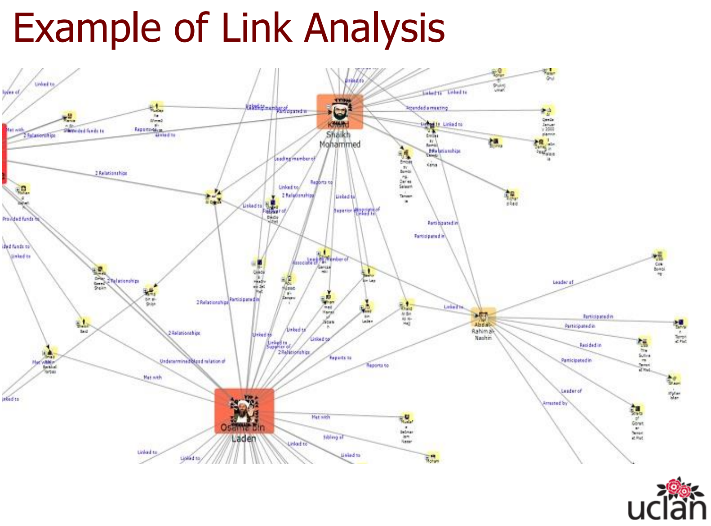
- Uses a network formed by nodes & links between nodes
- A variety of data sources can be used to build networks for link analysis, e.g. phone calls, financial transactions, Internet use, emails, incidents/crime documentation
- Link analysis is also very useful for investigative reconstruction for:
  - Relational, spatial and temporal reconstruction,
e.g. phone call records can be used to show acquaintance
among individual users, or phone call records can be used to show geographical displacements of a mobile phone to assess location of an individual before and after a crime
  - Victimology: relationships of the victim, potentially allowing a link between the victim and a potential suspect

### Crime Mapping
- Visualize crimes on a map to identify hot spots for specific crimes and geographical profiling

### Text Mining
### Pattern Recognition
- Pattern recognition looks for “most likely” matches given known patterns taking into account their statistical variations
### Suspect Profiles
- Criminal profiles are typically drawn from samples of behaviour, motives and methods of operation

# 6. Forensic Readiness
- The ability of an organisation to maximise its potential to use digital evidence, whilst minimising the costs of an investigation
- Forensic readiness is about being prepared for an incident/cybercrime
  - The incident may not be directed at the company. An important evidence may be stored on a company’s servers / device, e.g. email service provider
  - The incident may be directed at the company. Making the company the victim, e.g. DDoS attack
  - The incident may be caused by the company. Making the company the perpetrator, e.g. document theft
## 10 Steps for Forensic Readiness
1. Define the business scenarios that require digital evidence
2. Identify available sources and different types of potential evidence
3. Determine the evidence collection requirement 
4. Establish a capability for securely gathering legally admissible evidence to meet the requirement
5. Establish a policy for secure storage and handling of potential evidence
6. Ensure monitoring is targeted to detect and deter major incidents
7. Specify circumstances when escalation to a full formal investigation (which may use the digital evidence) should be launched
8. Train staff in incident awareness, so that all those involved understand their role in the digital evidence process and the legal sensitivities of evidence
9. Document an evidence-based case describing the incident and its impact
10. Ensure legal review to facilitate action in response to the incident

# 7. Ethics in Digital Forensic Investigations
## ACPO Code of Ethics
- ACPO provide seven principles to guide the conduct & behaviour of the police force. This includes forensic investigators:
  - Selflessness
  - Integrity
  - Objectivity
  - Accountability
  - Openness
  - Honesty
  - Leadership
## The Four Tracks of Ethics Model
### Duty and Responsibility (Duty of Forensic Experts)
- An expert must help the court to achieve the overriding objective by giving objective, unbiased opinion on matters within his expertise.
- Experts have a duty to present the:
  - objective, and
  - unbiased truth
- It is not investigators’ role to advocate for one side, that is the role of attorneys
### Utility and Justice (Principle of Legality and Accountability)
- Any action taken by the investigator shall be strictly in accordance with the law, not at the discretion of the investigator or anyone else
- Any action taken by the investigator should be relevant and its implications should be clearly explained when required

### Care (Principle of Necessity and Proportionality)
- Any action should be undertaken only if justifiably necessary for the intended purpose
- Any action should be proportionate to the legitimate aim pursued
  - Are there relevant or sufficient reasons for the action?
  - Is there a less restrictive alternative available?

### Virtue
- This principle emphasises the internal attributes of the investigator’s character
  - integrity
  - impartiality
  - honesty
  - openness
  - selflessness

## Possible traps to ethical behaviour for digital investigators
- Digital investigators may be pressured to concentrate on specific areas of inquiry and to reach conclusions favourable to a particular party
- Some cases and the nature of evidence take investigators to emotional limits, testing their capacity of impartiality
- Clients (e.g., individuals or companies) will believe firmly in their cause
- Attorneys have a responsibility to build the strongest case for their client
- Working environment or peer pressure may cause an impact on digital investigators
- A common error is to use a verification methodology, focusing on a likely suspect and trying to fit the evidence around that individual

# 8. Investigation software and techniques
# 9. Expert reporting, Data Representation
# 10. Relevant Laws
# 11. Mobile Devices
# 12. IoT Forensics

# Tools
## Whois Tools
- https://who.is/
- https://research.domaintools.com/research/whois-history/
- https://centralops.net/co/

## Network Tools
- https://centralops.net/co/
- https://ping.eu/
- https://networking.ringofsaturn.com/

## Operating System (OS)
- CAINE: https://www.caine-live.net/page5/page5.html
- 