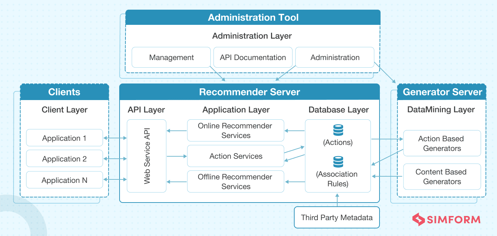
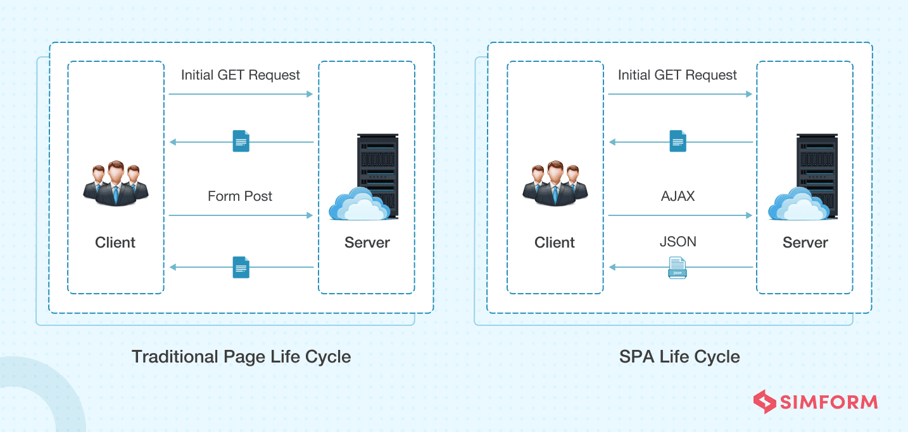
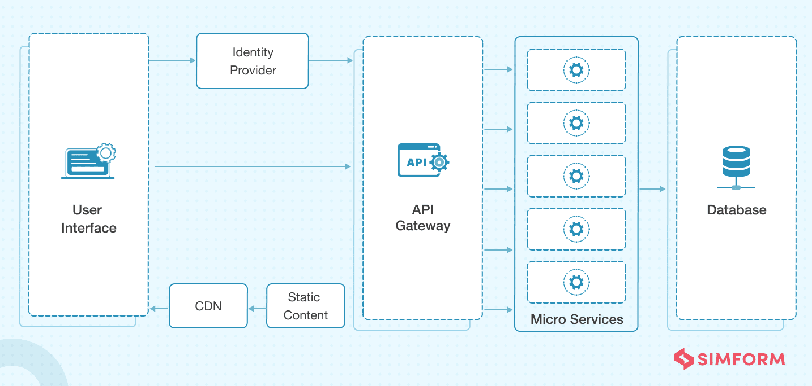
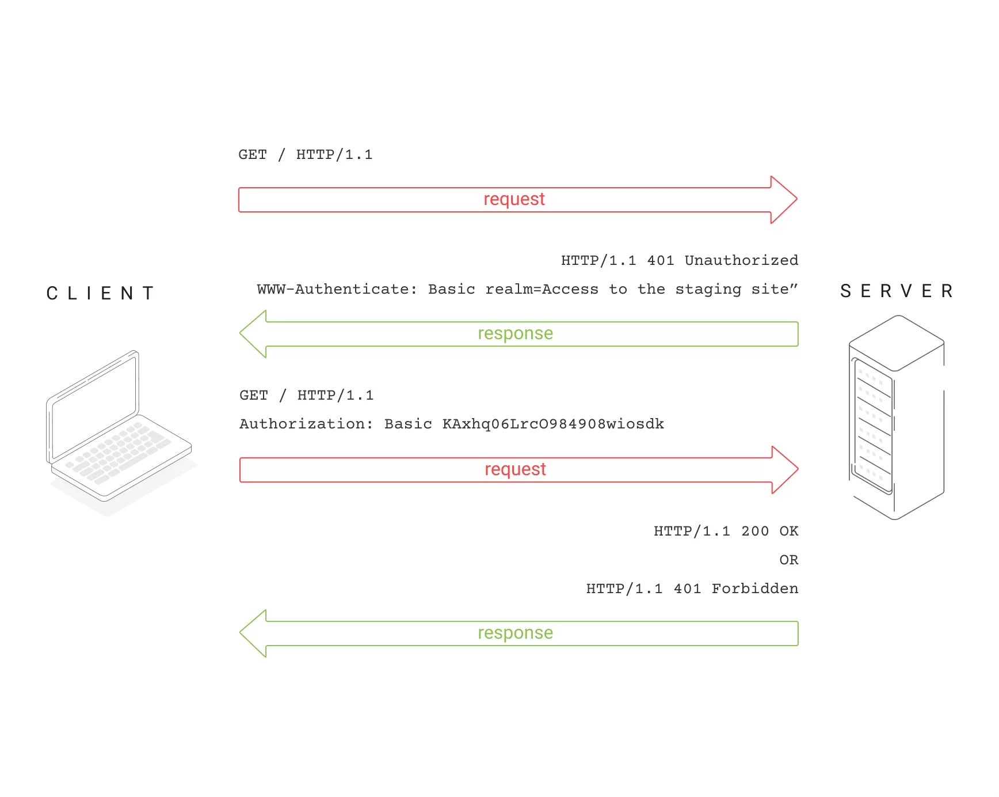

# Web Application Architecture
Web application architecture is a blueprint of simultaneous interactions between components, databases, middleware systems, user interfaces, and servers in an application. It can also be described as the layout that logically defines the connection between the server and client-side for a better web experience.


All applications are made up of two primary components: 

- Client-side, popularly called: the frontend, where the code is written in HTML, CSS, JavaScript and stored within the browser. It’s where user interaction takes place.
- Server-side, also known as the backend, controls the business logic and responds to HTTP requests. The server-side code is written in Java, PHP, Ruby, Python, etc.

Apart from this, there is an additional component i.e. database server, which sends the requested data to the server-side.  

## Types of Web Application Architecture
Web applications are broadly divided into following types:

### Single Page Application Architecture
SPA (Single Page Applications) has been introduced to overcome the traditional limitations to achieve smooth app performance, intuitive, and interactive user experience. 

Instead of loading a new page, SPAs load a single web page and reload the requested data on the same page with dynamically updated content, like Gmail. The rest of the web page remains untouched. They are developed on the client-side using JavaScript frameworks as the entire logic is always shifted to the frontend.


### Microservice Architecture
Microservice architecture has become the best alternative to Service-Oriented Architecture (SOA) and monolithic architecture. The services are loosely coupled to be developed, tested, maintained, and deployed independently. Such services can also communicate with other services through APIs to solve complex business problems. 



Deployment of web apps using monolithic architecture is a cumbersome task because of its tightly coupled components. Microservices has resolved this issue by separating the application into multiple individual service components. It further simplifies the connectivity between service components and eliminates the need for service orchestration. Some tech giants who are popular for using microservices are Amazon, Netflix, SoundCloud, Comcast, and eBay.

### Serverless Architecture
It’s an architecture where the whole execution of code is taken care of by cloud service providers– no need to deploy them manually on your server. Serverless architecture is a design pattern where applications are built and run without any manual intervention on the servers that are managed by third-party cloud service providers like Amazon and Microsoft.  

# HTTP Header
An HTTP header is a field of an HTTP request or response that passes additional context and metadata about the request or response. For example, a request message can use headers to indicate it's preferred media formats, while a response can use header to indicate the media format of the returned body. Headers are case-insensitive, begin at the start of a line and are immediately followed by a `:` and a header-dependent value. The value finishes at the next CRLF or at the end of the message.


[](https://www.youtube.com/watch?v=e1gAyQuIFQo)


## HTTP Request Header
A request header is an HTTP header that can be used in an HTTP request to provide information about the request context, so that the server can tailor the response. For example, the Accept-* headers indicate the allowed and preferred formats of the response. Other headers can be used to supply authentication credentials (e.g. Authorization), to control caching, or to get information about the user agent or referrer, etc.

The HTTP message below shows a few request headers after a `GET` request:

```http
GET /home.html HTTP/1.1

Host: developer.mozilla.org
User-Agent: Mozilla/5.0 (Macintosh; Intel Mac OS X 10.9; rv:50.0) Gecko/20100101 Firefox/50.0
Accept: text/html,application/xhtml+xml,application/xml;q=0.9,*/*;q=0.8
Accept-Language: en-US,en;q=0.5
Accept-Encoding: gzip, deflate, br
Referer: https://developer.mozilla.org/testpage.html
Connection: keep-alive
Upgrade-Insecure-Requests: 1
If-Modified-Since: Mon, 18 Jul 2016 02:36:04 GMT
If-None-Match: "c561c68d0ba92bbeb8b0fff2a9199f722e3a621a"
Cache-Control: max-age=0
```

## HTTP Response Header
A response header is an HTTP header that can be used in an HTTP response and that doesn't relate to the content of the message. Response headers, like Age, Location or Server are used to give a more detailed context of the response.

The following shows a few response and representation headers after a `GET` request.

```http
200 OK

Access-Control-Allow-Origin: *
Connection: Keep-Alive
Content-Encoding: gzip
Content-Type: text/html; charset=utf-8
Date: Mon, 18 Jul 2016 16:06:00 GMT
Etag: "c561c68d0ba92bbeb8b0f612a9199f722e3a621a"
Keep-Alive: timeout=5, max=997
Last-Modified: Mon, 18 Jul 2016 02:36:04 GMT
Server: Apache
Set-Cookie: mykey=myvalue; expires=Mon, 17-Jul-2017 16:06:00 GMT; Max-Age=31449600; Path=/; secure
Transfer-Encoding: chunked
Vary: Cookie, Accept-Encoding
X-Backend-Server: developer2.webapp.scl3.mozilla.com
X-Cache-Info: not cacheable; meta data too large
X-kuma-revision: 1085259
x-frame-options: DENY
```

## Authentication and authorization mechanisms
Authentication is a protocol used in HTTP communication to verify that a client is who they say they are before providing the client access to a certain resource on the web. This is another security procedure in the HTTP protocol to protect users and businesses in the online environment. When authentication is done at the edge, there is a significant increase in the speed and security of the process and, consequently, in the companies’ credibility and revenue.


### Challenge-Response Authentication
In challenge-response authentication, the server makes a request – the challenge – and the client must send a valid response to be authenticated. A very common example of challenge-response authentication is password authentication, where the challenge made by the server is to request the password and the valid response from the client is the correct password.

### Authentication Schemes
The general HTTP authentication framework is the base for a number of authentication schemes such as Basic, Bearer, Digest, HOBA, Mutual, etc.

#### Example: Basic Authentication
The `Basic` HTTP authentication scheme is defined in RFC 7617, which transmits credentials as user ID/password pairs, encoded using base64.

As the user ID and password are passed over the network as clear text (it is base64 encoded, but base64 is a reversible encoding), the basic authentication scheme is not secure. HTTPS/TLS should be used with basic authentication. Without these additional security enhancements, basic authentication should not be used to protect sensitive or valuable information.

-------
Resources:
- [An Ultimate Guide to Web Application Architecture](https://www.simform.com/blog/web-application-architecture/)
- [HTTP header](https://developer.mozilla.org/en-US/docs/Glossary/HTTP_header)
- [What Is HTTP Authentication?](https://www.azion.com/en/blog/what-is-http-authentication)
